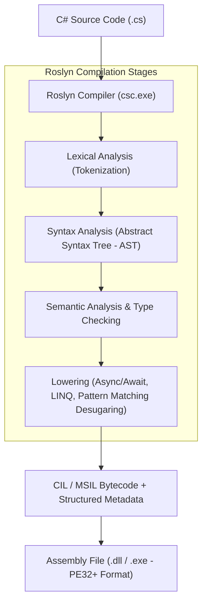
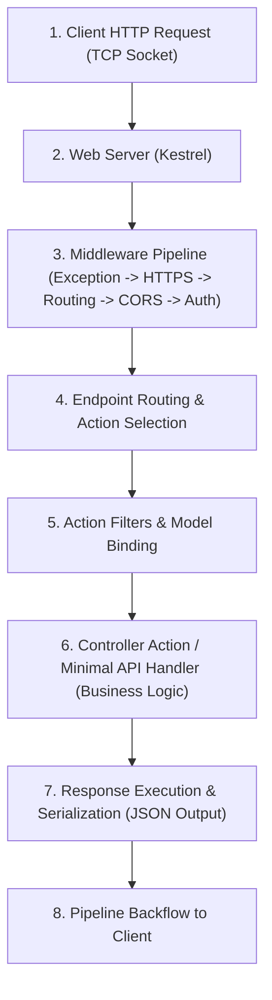

# ⚡ .NET & C# Execution Internals & Lifecycle (A to Z Master Guide)

এই ডকুমেন্টে C# এবং .NET-এর **Logical & Physical Execution Pipeline**, আধুনিক **.NET vs .NET Core vs ASP.NET Core-এর তুলনামূলক অ্যানালিসিস**, **Application & Request Lifecycle**, এবং **৩-৫ বছর অভিজ্ঞতাসম্পন্ন (Mid to Senior level)** ইঞ্জিনিয়ারদের জন্য ইন্টারভিউ প্রশ্নোত্তর বিস্তারিত আলোচনা করা হয়েছে।

---

## 📌 সূচিপত্র (Table of Contents)
1. [পর্ব ১: C# & .NET Logical Execution Pipeline](#-পর্ব-১-c--net-logical-execution-pipeline)
2. [পর্ব ২: Physical & Hardware Execution Pipeline](#-পর্ব-২-physical--hardware-execution-pipeline)
3. [পর্ব ৩: .NET Framework vs .NET Core vs ASP.NET Core Execution](#-পর্ব-৩-net-framework-vs-net-core-vs-aspnet-core-execution)
4. [পর্ব ৪: .NET Application Execution Lifecycle](#-পর্ব-৪-net-application-execution-lifecycle)
5. [পর্ব ৫: ASP.NET Core HTTP Request Processing Lifecycle](#-পর্ব-৫-aspnet-core-http-request-processing-lifecycle)
6. [পর্ব ৬: ৩-৫ বছর অভিজ্ঞতার জন্য ইন্টারভিউ Q&A স্ক্রিপ্ট](#-পর্ব-৬-৩-৫-বছর-অভিজ্ঞতার-জন্য-ইন্টারভিউ-qa-স্ক্রিপ্ট)

---

## 🚀 পর্ব ১: C# & .NET Logical Execution Pipeline

লজিক্যাল এক্সিকিউশন হলো সোর্স কোড লেখা থেকে শুরু করে প্ল্যাটফর্ম-ইন্ডিপেনডেন্ট ইন্টারমিডিয়েট কোড ও অ্যাসেম্বলি তৈরির পর্যায়ক্রমিক লজিক্যাল রূপান্তর।



### ১. Lexical Analysis (টোকেনাইজেশন)
- কোডের প্রতিটি লাইনকে ছোট ছোট মিনিংফুল ইউনিটে ভাগ করা হয়—যাদের **Tokens** বলা হয় (যেমন: কি-ওয়ার্ড `class`, `public`, আইডেন্টিফায়ার, অপারেটর ইত্যাদি)।

### ২. Syntax Analysis (ব্যাকরণ ও সিনট্যাক্স যাচাই)
- টোকেনগুলো নির্দিষ্ট ব্যাকরণ মেনে চলেছে কি না তা যাচাই করে একটি হায়ারার্কিক্যাল ট্রি তৈরি করা হয় যাকে **AST (Abstract Syntax Tree)** বলে। কোনো সিনট্যাক্স ভুল হলে এই ধাপে কম্পাইলার ব্রেক করে।

### ৩. Semantic Analysis & Type Checking (অর্থ ও টাইপ সুরক্ষা)
- ভ্যারিয়েবলের টাইপ সেফটি (যেমন: `int`-এ `string` অ্যাসাইনমেন্ট রোধ), মেথড সিগনেচার, স্কোপিং রুলস এবং ডিপেন্ডেন্ট লাইব্রেরি রেফারেন্স ভ্যালিডেট করা হয়।

### ৪. Lowering & Optimization (সিম্প্লিফিকেশন)
- আধুনিক হাই-লেভেল C# সিনট্যাক্সকে ব্যাকগ্রাউন্ডে বেসিক প্রিমিটিভ লজিকে ভেঙে ফেলা হয় (Lowering):
  - `async/await` রূপ নেয় জটিল **State Machine struct**-এ।
  - `LINQ` কুয়েরি কনভার্ট হয় লুপ এবং ডেলিগেট মেথড কলে।
  - `Records` রূপান্তর হয় প্লেইন ক্লাস, ইকুয়ালিটি মেথড এবং গেটার-সেটারে।

### ৫. Emission (CIL এবং Metadata জেনারেশন)
- চূড়ান্ত ধাপে কোডকে আর্কিটেকচার-স্বাধীন **CIL (Common Intermediate Language)** বা **MSIL**-এ রূপান্তর করা হয়।
- একই সাথে একটি কমপ্লিট **Metadata Table** (ক্লাস নেম, ফিল্ড, মেথড সিগনেচার, অ্যাট্রিবিউট) যুক্ত করে একটি **PE (Portable Executable)** ফাইল অর্থাৎ `.dll` বা `.exe` হিসেবে সেভ করা হয়।

---

## ⚙️ পর্ব ২: Physical & Hardware Execution Pipeline

ফিজিক্যাল এক্সিকিউশন হলো অপারেটিং সিস্টেম ও হার্ডওয়্যার লেভেলে (RAM, CPU, Cache, Registers) বাইনারি লোড হওয়া, নেটিভ কোডে কনভার্ট হওয়া এবং এক্সিকিউট হওয়ার বাস্তব পর্যায়।

```mermaid
flowchart TD
    subgraph HostInit ["১. Host & Process Bootstrap"]
        A["App Execution (dotnet run / native binary)"] --> B["corehost (hostfxr / hostpolicy)"]
        B --> C["Load coreclr.dll / libcoreclr.so into Virtual Memory"]
        C --> D["Initialize Runtime Subsystems (EE, GC, ThreadPool, TypeSystem)"]
    end

    subgraph MemoryTopology ["২. Memory & JIT Pipeline"]
        D --> E["Initialize Managed Heap (SOH: Gen0/1/2, LOH, POH) & Thread Stacks"]
        E --> F["Load IL Bytecode & Metadata (via AssemblyLoadContext)"]
        F --> G["Construct MethodTable & EEClass in Memory"]
        G --> H["RyuJIT Tiered Compilation Pipeline"]
    end

    subgraph HardwareExecution ["৩. CPU & Hardware Execution"]
        H -->|Startup: Quick JIT| I["Tier 0: Unoptimized Machine Code + Stubs"]
        I -->|Invocation Counter Triggered (Hot Path)| J["Tier 1 / Dynamic PGO: Inlining, Loop Unrolling, Vectorization (SIMD)"]
        J --> K["CPU Instruction Pipeline (Fetch -> Decode -> Execute)"]
        K --> L["CPU Caches (L1i, L1d, L2, L3) & Registers (RAX, RBX, RIP)"]
    end
```

### ১. Host Startup & Bootstrap (`hostfxr` ও `coreclr`)
- `dotnet run` বা বাইনারি রান করলে **Host Muxer (`hostfxr`)** সঠিক ফ্রেমওয়ার্ক ভার্সন নির্ধারণ করে মেমরিতে **CoreCLR Engine (`coreclr.dll` / `libcoreclr.so`)** লোড করে।
- রানটাইম ইনিশিয়ালাইজেশনের সাথে সাথে থ্রেডপুল (ThreadPool), এক্সেপশন হ্যান্ডলার এবং টাইপ সিস্টেম বুটস্ট্র্যাপ হয়।

### ২. টাইপ সিস্টেমের ফিজিক্যাল গঠন (MethodTable & EEClass)
- মেমরিতে প্রতিটি ক্লাসের জন্য দুটি মূল ডাটা স্ট্রাকচার তৈরি হয়:
  - **`EEClass`:** ক্লাসের মেটাডাটা ও স্ট্রাকচারাল বিবরণ ধারণ করে (Cold Data)।
  - **`MethodTable`:** রানটাইমে মেথড ডিসপ্যাচ ও ভার্চুয়াল মেথড কলের জন্য পয়েন্টার ধারণ করে (Hot Data)।
- প্রতিটি অবজেক্টের মেমরিতে দুটি ইন্টারনাল হিডেন হেডার থাকে:
  1. **SyncBlock Index (4 bytes / 8 bytes):** থ্রেড সিনক্রোনাইজেশন (`lock`) ও হ্যাশকোড ধরে রাখতে।
  2. **MethodTable Pointer:** অবজেক্টটি মেমরিতে কোন টাইপের তা নির্দেশ করতে।

### ৩. RyuJIT এর Tiered Compilation & Dynamic PGO
- **Tier 0 (Quick JIT):** কোনো হেভি অপ্টিমাইজেশন ছাড়াই তাত্ক্ষণিকভাবে মেশিন কোড তৈরি করে, যাতে অ্যাপ্লিকেশন স্টার্টআপ অত্যন্ত দ্রুত হয়। প্রতিটি মেথডের শুরুতে একটি ইনভোকেশন কাউন্টার বসানো থাকে।
- **Tier 1 (Optimized JIT):** কোনো মেথড ঘন ঘন এক্সিকিউট হলে (সাধারণত ৩০+ বার), ব্যাকগ্রাউন্ডে JIT মেথডটিকে পুনরায় ফুল অপ্টিমাইজেশন (Method Inlining, Loop Unrolling, Dead Code Elimination) দিয়ে মেশিন কোডে রূপান্তর করে মেমরি পয়েন্টার আপডেট করে।
- **Dynamic PGO (Profile-Guided Optimization):** অ্যাপ চলাকালীন লাইভ প্রোফাইল ডেটা সংগ্রহ করে মেথডের ব্রাঞ্চ প্রেডিকশন এবং ইন্টারফেস ডিভার্চুয়ালাইজেশন (Devirtualization) নিশ্চিত করে।

### ৪. CPU ও ক্যাশ লেভেলে এক্সিকিউশন
- জেনারেট হওয়া মেশিন কোড সরাসরি প্রসেসরের **L1 Instruction Cache (L1i)**-এ পুশ হয়।
- CPU-এর **Instruction Decoder** এগুলোকে মাইক্রো-অপারেশনে ভেঙে **Registers (RAX, RBX, RIP)** এবং **ALU** দিয়ে প্রসেস করে।

---

## ⚖️ পর্ব ৩: .NET Framework vs .NET Core vs ASP.NET Core Execution

লজিক্যাল দিক থেকে সবাই C# কোড থেকে IL তৈরি করে, কিন্তু রানটাইম ইঞ্জিন ও ফিজিক্যাল এক্সিকিউশনে মৌলিক পার্থক্য রয়েছে:

| বিষয় | ক্লাসিক .NET Framework (Legacy) | আধুনিক .NET / .NET Core (.NET 6/7/8/9) | ASP.NET Core Web API |
| :--- | :--- | :--- | :--- |
| **রানটাইম ইঞ্জিন** | **CLR** (`clr.dll`) — শুধু উইন্ডোজ বান্ধব। | **CoreCLR** (`coreclr.dll` / `libcoreclr.so`) — আল্ট্রা-ফাস্ট ও ক্রস-প্ল্যাটফর্ম। | ব্যাকএন্ডে একই **CoreCLR** ব্যবহার করে। |
| **হোস্টিং মেকানিজম** | IIS Worker Process (`w3wp.exe`) এর ভেতর ইন-প্রসেস রান হতো। | **Self-contained Process** (`dotnet.exe` বা নেটিভ স্ট্যান্ডঅ্যালোন রানার)। | `Program.cs` নিজে একটি স্বতন্ত্র কনসোল প্রসেস যা **Kestrel** সার্ভার বুটস্ট্র্যাপ করে। |
| **JIT কম্পাইলার** | Legacy JIT (ধীরগতির অপ্টিমাইজেশন)। | আধুনিক **RyuJIT** (Tiered JIT, Dynamic PGO, Hardware Intrinsics/SIMD)। | একই **RyuJIT** ইঞ্জিন। |
| **মেমরি ম্যানেজমেন্ট** | Traditional SOH + LOH। | SOH + LOH + **POH (Pinned Object Heap)**, লো-অ্যালোকেশন স্প্যান মেমরি। | হাই-থ্রুপুট **Server GC** (কোর প্রতি ডেডিকেটেড হিপ ও ডেডিকেটেড থ্রেড)। |
| **প্ল্যাটফর্ম সাপোর্ট** | ❌ কেবল Windows |  Windows, Linux, macOS, Docker কন্টেইনার |  ক্রস-প্ল্যাটফর্ম ডকার ও কুবারনেটিসে অপ্টিমাইজড |

---

## 🔄 পর্ব ৪: .NET Application Execution Lifecycle

একটি .NET কনসোল, ব্যাকগ্রাউন্ড সার্ভিস বা অ্যাপ্লিকেশনের সার্বিক জীবনচক্র ৪টি মূল ফেজে সম্পন্ন হয়:

```
[Phase 1: Build & Compile] 
          │
[Phase 2: Bootstrap & Host Startup]
          │
[Phase 3: Runtime Execution & Memory Loop]
          │
[Phase 4: Shutdown & Cleanup]
```

### ফেজ ১: Build & Compilation Phase (বিল্ড সময়)
- ডেভেলপার যখন `dotnet build` বা প্রকাশ করে, Roslyn কম্পাইলার কোড অ্যানালাইসিস করে CIL বাইটকোড ও মেটাডাটা সহ `.dll` অ্যাসেম্বলি তৈরি করে।

### ফেজ ২: Bootstrap & Host Startup Phase (বুটস্ট্র্যাপ সময়)
1. **OS Process Creation:** ওএস একটি নতুন প্রসেস ও ইনিশিয়াল থ্রেড তৈরি করে।
2. **Hostfxr Invocation:** রানটাইম ফ্রেমওয়ার্ক সিলেক্ট করে `coreclr.dll` লোড করা হয়।
3. **CoreCLR Initialization:** থ্রেডপুল, ভার্চুয়াল মেমরি এবং টাইপ সিস্টেম সেটআপ হয়।
4. **Entry Point Execution:** `Program.cs`-এর `Main()` মেথড বা টপ-লেভেল স্টেটমেন্ট এক্সিকিউট হওয়া শুরু হয়।

### ফেজ ৩: Runtime Execution & Memory Cycle (অ্যাপ্লিকেশন চলার সময়)
- **On-Demand JIT:** মেথড কল হওয়ার সাথে সাথে RyuJIT মেথডটিকে নেটিভ মেশিন কোডে রূপান্তর করে মেমরিতে রাখে।
- **GC Loop (Garbage Collection):**
  - নতুন অবজেক্ট **Gen 0**-তে যায়।
  - মেমরি চাপ বাড়লে GC রান করে:
    1. **Mark:** ব্যবহৃত লাইভ অবজেক্ট চিহ্নিত করে।
    2. **Sweep:** অব্যবহৃত অবজেক্ট মুছে ফেলে মেমরি ফাঁকা করে।
    3. **Compact:** মেমরির ফাঁকা জায়গাগুলো সাজিয়ে একীভূত করে (De-fragmentation)।
    4. দীর্ঘস্থায়ী অবজেক্টগুলো **Gen 1** এবং পরবর্তীতে **Gen 2**-তে প্রোমোট হয়।

### ফেজ ৪: Graceful Shutdown Phase (শাটডাউন সময়)
- `SIGTERM` বা ক্যান্সেলেশন টোকেন ট্রিগার হলে হোস্ট নতুন রিকোয়েস্ট নেওয়া বন্ধ করে।
- `IHostApplicationLifetime` ইভেন্টগুলো কল হয় (`ApplicationStopping` -> `ApplicationStopped`)।
- ব্যাকগ্রাউন্ড টাস্ক ড্রেন হয় এবং ডাটাবেজ কানেকশন ডিসপোজ হয়।
- CoreCLR মেমরি আনলোড করে ওএস প্রসেসটি নিরাপদে টার্মিনেট করে।

---

## 🌐 পর্ব ৫: ASP.NET Core HTTP Request Processing Lifecycle

ক্লায়েন্ট থেকে একটি ওয়েব রিকোয়েস্ট এসে ব্যাকএন্ড থেকে রেসপন্স ফিরে যাওয়া পর্যন্ত ৭টি ধাপ অতিক্রম করে:



1. **Web Server (Kestrel):** ক্লায়েন্ট থেকে TCP/HTTP রিকোয়েস্ট Kestrel ওয়েব সার্ভারে আসে। এটি একটি থ্রেডপুল থ্রেড বরাদ্দ করে এবং রিকোয়েস্টের জন্য একটি `HttpContext` তৈরি করে।
2. **Middleware Pipeline:** রিকোয়েস্টটি একের পর এক রেজিস্টার্ড মিডলওয়্যারের মধ্য দিয়ে যায়:
   - `ExceptionHandlerMiddleware` ➡️ `HttpsRedirection` ➡️ `RoutingMiddleware` ➡️ `CorsMiddleware` ➡️ `AuthenticationMiddleware` ➡️ `AuthorizationMiddleware`।
3. **Endpoint Routing:** রাউটিং ইঞ্জিন ইউআরএল এবং এইচটিটিপি ভার্ব দেখে কোন কন্ট্রোলারের কোন অ্যাকশন মেথড বা মিনিমাল এপিআই হ্যান্ডলার এক্সিকিউট হবে তা নির্বাচন করে।
4. **Action Filters & Model Binding:**
   - রিকোয়েস্ট বডি/কোয়েরি ডাটা পার্স হয়ে C# DTO মডেলে বাইন্ড হয় এবং ডাটা ভ্যালিডেশন (`DataAnnotations` বা `FluentValidation`) রান করে।
   - `IActionFilter.OnActionExecuting` হুক রান হয়।
5. **Controller Action & Business Logic:** সার্ভিস ও রিপোজিটরি লেয়ার কল হয়ে মূল ডাটাবেজ অপারেশন বা বিজনেস লজিক সম্পন্ন হয়।
6. **Result Execution:** অ্যাকশন মেথড যা রিটার্ন করে (যেমন: `Ok(result)`), তা `System.Text.Json` দিয়ে JSON ফরম্যাটে সিরিয়ালাইজ হয়।
7. **Response Pipeline Backflow:** রেসপন্সটি ফিরতি পথে পুনরায় মিডলওয়্যার পাইপলাইন হয়ে Kestrel-এর মাধ্যমে ক্লায়েন্টের কাছে সেন্ট হয়।

---

## 🎙️ পর্ব ৬: ৩-৫ বছর অভিজ্ঞতার জন্য ইন্টারভিউ Q&A স্ক্রিপ্ট

### প্রশ্ন: ".NET কীভাবে কাজ করে? এর আর্কিটেকচারাল এক্সিকিউশন ব্যাখ্যা করুন।"

#### আদর্শ উত্তরের স্ক্রিপ্ট:
> "Sir, .NET-এর কাজ করার পদ্ধতি মূলত দুটি মূল ধাপে সম্পন্ন হয়: **Compile-time Execution** এবং **Runtime Execution (CoreCLR)**।
> 
> **১. Compile-time (Roslyn):**  
> আমরা যখন C# কোড বিল্ড করি, তখন **Roslyn Compiler** সিনট্যাক্স ও টাইপ ভ্যালিডেশন সম্পন্ন করে কোডকে আর্কিটেকচার-স্বাধীন **CIL (Common Intermediate Language)** বা **MSIL**-এ কনভার্ট করে। একই সাথে ক্লাসের যাবতীয় টাইপ ও মেম্বারদের বিবরণ সম্বলিত একটি **Metadata Table** তৈরি করে এবং উভয়কে একসাথে একটি **PE ফাইল (.dll বা .exe)** হিসেবে প্যাকেজ করে।
> 
> **২. Runtime Execution (CoreCLR):**  
> অ্যাপ্লিকেশনটি যখন রান করা হয়, অপারেটিং সিস্টেমে হোস্ট প্রসেস শুরু হয়ে মেমরিতে **CoreCLR Engine** লোড করে। CoreCLR মূলত অ্যাপ্লিকেশনের হার্ট—যা মেমরি ম্যানেজমেন্ট, থ্রেডপুল, এক্সেপশন হ্যান্ডলিং এবং টাইপ সেফটি পরিচালনা করে।
> 
> **৩. JIT & Tiered Compilation:**  
> সিপিইউ সরাসরি CIL বোঝে না। তাই CoreCLR-এর ভেতরের **RyuJIT Compiler** রানটাইমে প্রয়োজন অনুযায়ী (On-Demand) মেথডগুলোকে নেটিভ মেশিন কোডে রূপান্তর করে। আধুনিক .NET (Core 6/7/8/9)-এ এটি **Tiered Compilation** আর্কিটেকচারে চলে:
> - **Tier 0 (Quick JIT):** কোনো ভারী অপ্টিমাইজেশন ছাড়াই খুব দ্রুত মেশিন কোড বানায়, যাতে অ্যাপ্লিকেশন খুব ফাস্ট বুটস্ট্র্যাপ হতে পারে।
> - **Tier 1 ও Dynamic PGO:** কোনো মেথড যখন বারবার কল হয় (Hot Path), ব্যাকগ্রাউন্ডে JIT সেগুলোকে লুপ আনরোলিং, মেথড ইনলাইনিং ও ব্রাঞ্চ প্রেডিকশন অপ্টিমাইজেশন দিয়ে ফুল পারফরম্যান্ট কোডে কনভার্ট করে।
> 
> **৪. Memory Management & GC:**  
> রানটাইমে মেমরি প্রধানত **Stack** (মেথড ফ্রেম, ভ্যালু টাইপ) এবং **Managed Heap** (অবজেক্ট ও রেফারেন্স টাইপ)-এ বিভক্ত থাকে। মেমরি লিক রোধ করতে CoreCLR-এর **Garbage Collector (GC)** ৩টি জেনারেশন (Gen 0, 1, 2) এবং বড় অবজেক্টের জন্য **LOH** ও **POH** ব্যবহার করে স্বয়ংক্রিয়ভাবে মেমরি ক্লিনআপ ও ডিফ্র্যাগমেন্টেশন পরিচালনা করে।"

---

### ইন্টারভিউয়ারের সম্ভাব্য ক্রস-কোয়েশ্চেন ও ১ লাইনের উত্তর:

| প্রশ্ন | সিনিয়র লেভেল ১ লাইনের উত্তর |
| :--- | :--- |
| **JIT আর Native AOT-এর পার্থক্য কী?** | JIT রানটাইমে অন-ডিমান্ড মেশিন কোড বানায়, আর Native AOT বিল্ড টাইমেই সরাসরি মেশিন কোড তৈরি করে দেয় (ফলে স্টার্টআপ ইনস্ট্যান্ট হয় এবং মেমরি ফুটপ্রিন্ট অনেক কম লাগে)। |
| **Stack আর Heap-এর মধ্যে পার্থক্য কী?** | Stack মেথড ফ্রেম অনুযায়ী অত্যন্ত দ্রুত LIFO অর্ডারে পুশ/পপ হয়; Heap রেফারেন্স অবজেক্ট ধারণ করে যা GC-এর মাধ্যমে মার্ক, সুইপ ও কমপ্যাক্ট হতে হয়। |
| **LOH (Large Object Heap) কী এবং কেন আলাদা?** | ৮৫,০০০ বাইটের চেয়ে বড় অবজেক্টগুলো LOH-এ থাকে। এগুলোকে সাধারণ হিপের মতো ঘন ঘন কমপ্যাক্ট (স্থানান্তর) করা হলে সিস্টেমের সিপিইউ কস্ট অনেক বেড়ে যাবে, তাই এদের আলাদা পরিচালনা করা হয়। |
| **Server GC বনাম Workstation GC কী?** | Workstation GC সিঙ্গেল থ্রেডে ইউআই রেসপন্সিভনেস নিশ্চিত করে; আর Server GC মাল্টি-কোর সিপিইউতে প্রতিটি কোরের জন্য আলাদা ডেডিকেটেড হিপ ও থ্রেড বানিয়ে হাই-কনকারেন্সি নিশ্চিত করে। |
