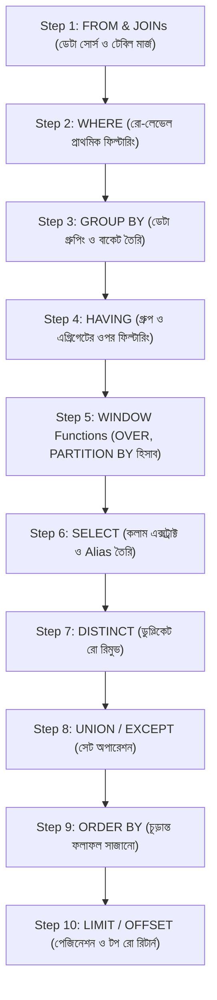
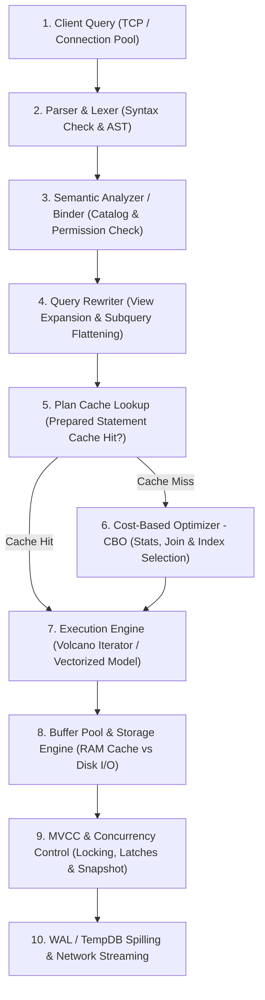
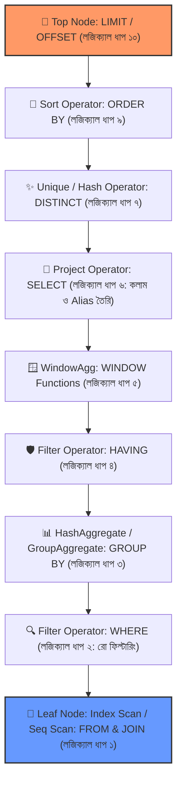

# ⚡ SQL Query Execution Order & Database Engine Internals (A to Z Master Guide)

এই ডকুমেন্টে SQL কুয়েরির **লজিক্যাল এক্সিকিউশন অর্ডার (Logical Processing Order)** এবং ব্যাকএন্ডে ডাটাবেজ ইঞ্জিনের ভেতরে ঘটা **১০টি ইন্টারনাল ফিজিক্যাল লাইফসাইকেল ও এক্সিকিউশন পাইপলাইন (Engine Internals for Senior Engineers)** বিস্তারিত আলোচনা করা হয়েছে।

---

## 📌 সূচিপত্র (Table of Contents)
1. [পর্ব ১: লজিক্যাল এক্সিকিউশন অর্ডার (Logical Query Processing Order)](#-পর্ব-১-লজিক্যাল-এক্সিকিউশন-অর্ডার-logical-query-processing-order)
   - [লেখার ক্রম (Writing Order) বনাম চলার ক্রম (Execution Order)](#-লেখার-ক্রম-writing-order-বনাম-চলার-ক্রম-execution-order)
   - [ধাপে ধাপে এক্সিকিউশন পাইপলাইন (Visual Pipeline)](#-ধাপে-ধাপে-এক্সিকিউশন-পাইপলাইন-visual-pipeline)
   - [A to Z প্রতিটি ধাপের বিশদ ব্যাখ্যা](#-a-to-z-প্রতিটি-ধাপের-বিশদ-ব্যাখ্যা)
   - [বাস্তব কোড উদাহরণ](#-বাস্তব-কোড-উদাহরণ)
   - [ইন্টারভিউয়ের জন্য ৩টি কমন ট্রিকি প্রশ্ন](#-ইন্টারভিউয়ের-জন্য-৩টি-কমন-ট্রিকি-প্রশ্ন)
2. [পর্ব ২: সিনিয়র ইঞ্জিনিয়ার লেভেল - ১০টি ইন্টারনাল ফিজিক্যাল ধাপ (Engine Internals)](#-পর্ব-২-সিনিয়র-ইঞ্জিনিয়ার-লেভেল---১০টি-ইন্টারনাল-ফিজিক্যাল-ধাপ-engine-internals)
   - [ফিজিক্যাল কুয়েরি লাইফসাইকেল আর্কিটেকচার](#-ফিজিক্যাল-কুয়েরি-লাইফসাইকেল-আর্কিটেকচার)
   - [১০টি ইন্টারনাল ফিজিক্যাল ধাপের বিশদ ব্যাখ্যা](#-১০টি-ইন্টারনাল-ফিজিক্যাল-ধাপের-বিশদ-ব্যাখ্যা)
   - [সিনিয়র ইঞ্জিনিয়ারদের জন্য টেকনিক্যাল সামারি](#-সিনিয়র-ইঞ্জিনিয়ারদের-জন্য-টেকনিক্যাল-সামারি)
3. [পর্ব ৩: ফিজিক্যাল ধাপের কোথায় লজিক্যাল অর্ডার এক্সিকিউট হয়?](#-পর্ব-৩-ফিজিক্যাল-ধাপের-কোথায়-লজিক্যাল-অর্ডার-এক্সিকিউট-হয়)
   - [ফিজিক্যাল অপারেটর ট্রি (Execution Plan Tree)](#-ফিজিক্যাল-অপারেটর-ট্রি-execution-plan-tree)
   - [ফিজিক্যাল ধাপগুলোর সাথে লজিক্যাল অর্ডারের সংযোগ ও ডেটা ফ্লো](#-ফিজিক্যাল-ধাপগুলোর-সাথে-লজিক্যাল-অর্ডারের-সংযোগ-ও-ডেটা-ফ্লো)
   - [এক নজরে সামারি টেবিল](#-এক-নজরে-সামারি-টেবিল)

---

# 🚀 পর্ব ১: লজিক্যাল এক্সিকিউশন অর্ডার (Logical Query Processing Order)

SQL কোড আমরা যেভাবে **লিখি (Writing / Lexical Order)**, ডাটাবেজ ইঞ্জিন কিন্তু সেভাবে **চালায় না (Logical Execution Order)**। 

আমরা সবার প্রথমে `SELECT` লিখি, কিন্তু ডাটাবেজ ইঞ্জিন `SELECT`-কে এক্সিকিউট করে প্রায় **সবার শেষে**।

---

### 📝 লেখার ক্রম (Writing Order) বনাম চলার ক্রম (Execution Order)

```
✍️ আমরা যেভাবে লিখি (Syntax):              ⚙️ ডাটাবেজ ইঞ্জিন যেভাবে চালায় (Execution):
──────────────────────────────             ──────────────────────────────────────────
1. SELECT                                  1. FROM & JOIN (ON)
2. FROM & JOIN                             2. WHERE
3. WHERE                                   3. GROUP BY
4. GROUP BY                                4. HAVING
5. HAVING                                  5. WINDOW Functions (OVER)
6. SELECT (Projection)                     6. SELECT (Expressions & Aliases)
7. DISTINCT                                7. DISTINCT
8. ORDER BY                                8. UNION / INTERSECT / EXCEPT
9. LIMIT / OFFSET                          9. ORDER BY
                                           10. LIMIT / OFFSET / TOP
```

---

### 🔄 ধাপে ধাপে এক্সিকিউশন পাইপলাইন (Visual Pipeline)



---

### 🔍 A to Z প্রতিটি ধাপের বিশদ ব্যাখ্যা

#### ধাপ ১: `FROM` & `JOIN` (টেবিল লোড ও জয়েনিং)
* ডাটাবেজ সবার আগে দেখে কুয়েরিটি কোন কোন টেবিল থেকে ডেটা নিতে চাইছে।
* যদি `JOIN` থাকে, তবে `ON` শর্তের ভিত্তিতে টেবিলগুলোকে মেমোরিতে যুক্ত (Join) করে একটি ভার্চুয়াল ওয়ার্কিং টেবিল তৈরি করে।
* `LEFT/RIGHT OUTER JOIN` হলে ম্যাচ না হওয়া অবশিষ্ট সারিগুলোকেও এই ধাপে যুক্ত করা হয়।

#### ধাপ ২: `WHERE` (রো-লেভেল ফিল্টার)
* `FROM/JOIN` থেকে প্রাপ্ত প্রাথমিক টেবিলের ওপর সারি ধরে ধরে (Row-by-Row) শর্ত চেক করে।
* যে রোগুলো শর্ত পূরণ করে না, সেগুলোকে বাদ দিয়ে রেজাল্ট সেট ছোট করে ফেলে।
* **গুরুত্বপূর্ণ:** এই ধাপে কোনো এগ্রিগেট ফাংশন (`SUM`, `AVG`) বা `SELECT`-এ দেওয়া Alias ব্যবহার করা যায় না।

#### ধাপ ৩: `GROUP BY` (সারিগুলোকে গ্রুপে ভাগ করা)
* `WHERE` থেকে ফিল্টার হয়ে আসা রোগুলোকে নির্দিষ্ট কলামের অভিন্ন মানের ভিত্তিতে আলাদা আলাদা গ্রুপ বা বাকেটে ভাগ করে।
* যেমন: সব ডিপার্টমেন্টের ডেটাকে ডিপার্টমেন্ট ওয়াইজ আলাদা বান্ডিল বানিয়ে ফেলে।

#### ধাপ ৪: `HAVING` (গ্রুপের ওপর শর্ত ফিল্টার)
* `GROUP BY` হয়ে যাওয়ার পর প্রতিটি গ্রুপের এগ্রিগেট হিসাবের ওপর ফিল্টার করা হয় (যেমন: `HAVING COUNT(*) > 5` বা `HAVING AVG(salary) > 50000`)।
* **মনে রাখবেন:** সাধারণ রো ফিল্টার `WHERE`-এ হয়, আর এগ্রিগেটেড গ্রুপ ফিল্টার `HAVING`-এ হয়।

#### ধাপ ৫: `WINDOW` Functions (`OVER()`)
* যদি কুয়েরিতে কোনো উইন্ডো বা অ্যানালিটিক ফাংশন (যেমন: `ROW_NUMBER()`, `RANK()`, `LEAD()`, `LAG()`) থাকে, তা এই ধাপে এক্সিকিউট হয়।

#### ধাপ ৬: `SELECT` (কলাম সিলেকশন ও ক্যালকুলেশন)
* অবশেষে ইঞ্জিন সিদ্ধান্ত নেয় আউটপুটে কোন কোন কলাম দেখাতে হবে।
* গাণিতিক হিসেব-নিকাশ (`price * quantity`) এবং কলামের নতুন নাম বা **Alias** (`AS total_price`) এই ধাপেই প্রথম জন্ম নেয়।

#### ধাপ ৭: `DISTINCT` (ডুপ্লিকেট অপসারণ)
* `SELECT` হওয়ার পর যদি `DISTINCT` কিওয়ার্ড থাকে, তবে আউটপুট লিস্টের হুবহু ডুপ্লিকেট সারিগুলোকে ফেলে দিয়ে কেবল ইউনিক রোগুলো রাখা হয়।

#### ধাপ ৮: Set Operations (`UNION` / `INTERSECT` / `EXCEPT`)
* যদি একাধিক কুয়েরি `UNION` বা `EXCEPT` দিয়ে জোড়া দেওয়া থাকে, তবে সেগুলো একত্র করে সমন্বিত রেজাল্ট সেট তৈরি করা হয়।

#### ধাপ ৯: `ORDER BY` (সর্টিং / সাজানো)
* প্রাপ্ত চূড়ান্ত ডেটাকে ব্যবহারকারীর পছন্দ অনুযায়ী অ্যাসেন্ডিং (`ASC`) বা ডিসেন্ডিং (`DESC`) অর্ডারে সাজানো হয়।
* **কেন এখানে Alias কাজ করে?** কারণ `SELECT` (ধাপ ৬) আগেই চলে গেছে, ফলে `SELECT`-এর তৈরি করা Alias নামগুলো `ORDER BY` (ধাপ ৯) চিনতে পারে।

#### ধাপ ১০: `LIMIT` / `OFFSET` / `TOP` (আউটপুট সাইজ নির্ধারণ)
* সর্ট করা তালিকার ওপর থেকে ব্যবহারকারী যতটি রো দেখতে চেয়েছেন (যেমন: `LIMIT 10 OFFSET 20`), ঠিক ততটি রো কেটে ক্লায়েন্টকে রেসপন্স পাঠানো হয়।

---

### 💻 বাস্তব কোড উদাহরণ

```sql
SELECT 
    dept_id, 
    AVG(salary) AS avg_sal        -- [ধাপ ৬: কলাম ও Alias তৈরি]
FROM employees                    -- [ধাপ ১: টেবিল লোড]
WHERE is_active = 1               -- [ধাপ ২: নিষ্ক্রিয় কর্মী বাদ]
GROUP BY dept_id                  -- [ধাপ ৩: ডিপার্টমেন্ট অনুযায়ী গ্রুপ]
HAVING AVG(salary) > 50000        -- [ধাপ ৪: ৫০ হাজারের বেশি গড় বেতন ফিল্টার]
ORDER BY avg_sal DESC             -- [ধাপ ৯: সর্বোচ্চ গড় অনুযায়ী সাজানো]
LIMIT 3;                          -- [ধাপ ১০: টপ ৩টি ডিপার্টমেন্ট রিটার্ন]
```

---

### 💡 ইন্টারভিউয়ের জন্য ৩টি কমন ট্রিকি প্রশ্ন

#### প্রশ্ন ১: `WHERE` ক্লজের ভেতরে `SELECT`-এর কলাম Alias ব্যবহার করলে এরর দেয় কেন?
* **উত্তর:** কারণ ডাটাবেজ ইঞ্জিন `WHERE` ক্লজ চালায় **ধাপ ২**-এ, অথচ কলামের Alias তৈরি হয় **ধাপ ৬**-এর `SELECT` ক্লজে। ধাপ ২ চলার সময় ইঞ্জিন Alias-এর অস্তিত্বই জানে না।

#### প্রশ্ন ২: `ORDER BY` ক্লজে কি `SELECT`-এর Alias ব্যবহার করা বৈধ?
* **উত্তর:** হ্যাঁ, সম্পূর্ণ বৈধ! কারণ `ORDER BY` এক্সিকিউট হয় **ধাপ ৯**-এ, যা ধাপ ৬-এর `SELECT`-এর অনেক পরে। তাই `ORDER BY` সব Alias চেনে।

#### প্রশ্ন ৩: `WHERE` দিয়ে ফিল্টার করা `HAVING` দিয়ে ফিল্টার করার চেয়ে দ্রুত কেন?
* **উত্তর:** `WHERE` চলে **ধাপ ২**-এ (গ্রুপিং-এর আগে)। ফলে শুরুতেই হাজার হাজার অপ্রয়োজনীয় রো বাদ পড়ে যায় এবং মেমোরিতে খুব কম রো গ্রুপিং হয়। পক্ষান্তরে `HAVING` সব ডেটা গ্রুপ ও এগ্রিগেট করার পর **ধাপ ৪**-এ ফিল্টার করে, যা অনেক বেশি রিসোর্স খরচ করায়।

---

# 🏛️ পর্ব ২: সিনিয়র ইঞ্জিনিয়ার লেভেল - ১০টি ইন্টারনাল ফিজিক্যাল ধাপ (Engine Internals)

একজন **Senior / Principal Database & Backend Engineer** হিসেবে কুয়েরি বোঝার ক্ষেত্রে সাধারণ লজিক্যাল স্টেপস (Logical Steps) যথেষ্ট নয়। ডাটাবেজ ইঞ্জিনের ভেতরে পাঠানো SQL কোডটি ক্লায়েন্ট থেকে ডিস্ক এবং মেমোরিতে কীভাবে এক্সিকিউট হয়, তার একটি **Physical & Architectural Lifecycle** রয়েছে।

---

### 🏗️ ফিজিক্যাল কুয়েরি লাইফসাইকেল আর্কিটেকচার



---

### ⚙️ ১০টি ইন্টারনাল ফিজিক্যাল ধাপের বিশদ ব্যাখ্যা

#### ধাপ ১: Connection Handling & Transport Phase
* অ্যাপ্লিকেশন (যেমন: .NET/Node.js) থেকে **TCP Socket** বা **Connection Pooler (যেমন: PgBouncer)** হয়ে কুয়েরি টেক্সট ডাটাবেজে পৌঁছায়।
* সার্ভারের একটি ডেডিকেটেড থ্রেড/প্রসেস রিকোয়েস্টটি রিসিভ করে।

#### ধাপ ২: Parser & Lexer (টোকেনাইজেশন ও সিনট্যাক্স ভ্যালিডেশন)
* **Lexical Analysis:** SQL স্ট্রিংটিকে ছোট ছোট টোকেনে (`SELECT`, `users`, `WHERE`, `id`) ভাগ করে।
* **Syntax Analysis:** গ্রামার চেক করে একটি **Abstract Syntax Tree (AST)** তৈরি করে। যদি কোনো কমা বা কিওয়ার্ড ভুল থাকে, এই ধাপেই `Syntax Error` থ্রো করে।

#### ধাপ ৩: Semantic Analysis / Binder (সিস্টেম ক্যাটালগ ও মেটাডাটা চেক)
* ডাটাবেজ ক্যাটালগ (`pg_class`, `sys.tables`) থেকে ভ্যালিডেট করে:
  1. টেবিল এবং কলামগুলোর অস্তিত্ব আছে কি না?
  2. কলামের ডেটা টাইপ কি অপারেশনের সাথে মিলছে? (Type Compatibility)
  3. ব্যবহারকারীর এই টেবিলে ডেটা পড়ার **Permission / Role** আছে কি না?

#### ধাপ ৪: Query Rewriter / Normalization (কুয়েরি রি-রাইট)
ইঞ্জিন কুয়েরি অপ্টিমাইজ করার জন্য কোডটিকে রি-রাইট করে:
* **View Expansion:** যদি কুয়েরিতে কোনো `VIEW` থাকে, সেটির ভেতরের আসল কুয়েরিকে এনে মূল AST-তে ইনলাইন করে।
* **Constant Folding:** ফিক্সড হিসেব আগেই করে ফেলে (যেমন: `WHERE price > 100 + 50` কে বদলে `WHERE price > 150` বানিয়ে ফেলে)।
* **Subquery Unnesting:** সাবকুয়েরিকে সম্ভব হলে পারফরম্যান্স বাড়ানোর জন্য `INNER/LEFT JOIN`-এ রূপান্তর করে।
* **Predicate Pushdown:** ফিল্টার কন্ডিশনকে যতটা সম্ভব ডেটা সোর্সের একদম শুরুতে ঠেলে দেয়।

#### ধাপ ৫: Plan Cache Lookup (প্রি-কম্পাইল্ড প্ল্যান ক্যাশ)
* ডাটাবেজ চেক করে এই কুয়েরির (বিশেষ করে **Prepared Statement / Parameterized Query**) কোনো কম্পাইল্ড এক্সিকিউশন প্ল্যান মেমোরিতে (Plan Cache) আগেই তৈরি আছে কি না।
* **Cache Hit:** ক্যাশে পাওয়া গেলে নিচের সবচেয়ে ভারী কাজ (ধাপ ৬: অপ্টিমাইজার) পুরোপুরি স্কিপ করে সরাসরি ধাপ ৭-এ চলে যায়।
* **Cache Miss:** অপ্টিমাইজারে পাঠায়।

#### ধাপ ৬: Cost-Based Optimizer (CBO - ডাটাবেজের মস্তিষ্ক)
এটি ডাটাবেজ ইঞ্জিনের সবচেয়ে গুরুত্বপূর্ণ অংশ। অপ্টিমাইজার সম্ভাব্য শত শত এক্সিকিউশন প্ল্যান তৈরি করে এবং সবচেয়ে কম খরচের (**Lowest Cost: CPU + Disk I/O**) প্ল্যানটি বেছে নেয়:
1. **Histogram & Statistics Analysis:** ডাটাবেজে টেবিলের সাইজ, কার্ডিনালিটি (সারি সংখ্যা), এবং ডেটার ডিস্ট্রিবিউশন স্ট্যাট দেখে।
2. **Access Path Selection:** সিদ্ধান্ত নেয়—
   * **Index Seek / Index Scan:** ইনডেক্স ব্যবহার করবে?
   * নাকি **Sequential Scan (Table Scan):** পুরো টেবিল একবারে রিড করা সস্তা হবে?
3. **Join Algorithm Selection:** একাধিক টেবিল যুক্ত করতে কোন অ্যালগরিদম চালাবে:
   * **Nested Loop Join:** ছোট টেবিলের জন্য সেরা ($O(N \times M)$)।
   * **Hash Join:** বড় টেবিলের ক্ষেত্রে মেমোরিতে হ্যাশ টেবিল তৈরি করে ($O(N + M)$)।
   * **Merge Join (Sort-Merge):** ডেটা আগেই সর্ট করা থাকলে সবচেয়ে দ্রুত।
4. **Parallelism:** মাল্টিপল CPU কোর ব্যবহার করে প্যারালাল স্ক্যান (`Gather Workers`) করবে কি না তা ঠিক করে।

#### ধাপ ৭: Execution Engine (Volcano Iterator vs Vectorized Execution)
তৈরি হওয়া ফিজিক্যাল প্ল্যানটি এক্সিকিউটরে যায়:
* **Volcano Iterator Model (Row-by-Row Pipeline):** নোডগুলো একে অপরকে `Open()`, `Next()`, `Close()` ফাংশন দিয়ে ট্রিগার করে। একটি করে রো প্রসেস হয়ে উপরে উঠে আসে (Memory Efficient)।
* **Vectorized Execution (আধুনিক OLAP/Columnar DB):** একবারে ১টি রো নয়, বরং ব্যাচ আকারে **১০২৪টি রো** একসাথে CPU SIMD ইন্সট্রাকশন দিয়ে প্রসেস করে।

#### ধাপ ৮: Storage Engine & Buffer Pool Manager (RAM vs Disk)
* ডাটাবেজ কখনো সরাসরি ডিস্ক থেকে রো পড়ে না, ডাটাবেজ কাজ করে **8KB বা 16KB Page** নিয়ে।
* **Buffer Pool / Shared Buffers (RAM):** ইঞ্জিন দেখে ডেটার পেজটি মেমোরিতে অলরেডি আছে কি না।
  * **Cache Hit (Memory Read):** ন্যানোসেকেন্ডে ডেটা মেমোরি থেকে রিটার্ন করে।
  * **Cache Miss (Physical I/O):** ডিস্ক (NVMe/SSD) থেকে পেজটি মেমোরিতে তুলে আনে (অনেক স্লো)।

#### ধাপ ৯: Concurrency, MVCC & Lock Manager
* **MVCC (Multi-Version Concurrency Control):** কুয়েরি শুরুর মুহূর্তের একটি **Snapshot** নেয়। ট্রানজ্যাকশন আইসোলেশন লেভেল অনুযায়ী আনকমিটেড বা ডিলিট হওয়া ডেটা (`xmin`, `xmax`) ফিল্টার করে আলাদা করে।
* **Locking & Latches:** ডেটা কনসিস্টেন্সি নিশ্চিত করতে মেমোরি পেজ এবং রো-এর ওপর প্রয়োজনীয় Shared (`S`) বা Exclusive (`X`) লক প্রয়োগ করে।

#### ধাপ ১০: Memory Spilling, WAL & Wire Protocol Streaming
* **WorkMem / TempDB Spilling:** যদি `ORDER BY` বা `Hash Join`-এর জন্য নির্ধারিত র্যাম মেমোরি (`work_mem` / Memory Grant) ডেটার তুলনায় কম হয়, তবে ডাটাবেজ মেমোরি ছেড়ে ডিস্কে টেম্পোরারি ফাইল তৈরি করে ডেটা সর্ট করে (**Disk Spilling - চরম স্লো হওয়ার মূল কারণ**)।
* **WAL (Write-Ahead Logging):** যদি `INSERT/UPDATE/DELETE` হয়, তবে আসল পেজে লেখার আগে **WAL / Redo Log**-এ ডিস্কে রাইট করে ডিউরেবিলিটি (ACID) নিশ্চিত করে।
* **Result Streaming:** ফলাফল প্রস্তুত হলে তা **Postgres/TDS Wire Protocol** প্যাকেটে রূপান্তর করে টিসিপি সকেটের মাধ্যমে ক্লায়েন্ট অ্যাপ্লিকেশনে স্ট্রিম করে পাঠিয়ে দেওয়া হয়।

---

### 👨‍💻 সিনিয়র ইঞ্জিনিয়ারদের জন্য টেকনিক্যাল সামারি

| স্তর | যা ঘটে | অপ্টিমাইজেশনের সুযোগ |
| :--- | :--- | :--- |
| **Parsing & Binding** | সিনট্যাক্স ও স্কিমা চেক | Prepared Statements ব্যবহার করে পার্সিং ও ক্যাশ টাইম বাঁচানো। |
| **CBO Optimization** | সঠিক ইনডেক্স ও জয়েন বাছাই | রেগুলার `ANALYZE` চালিয়ে ডাটাবেজ টেবিল স্ট্যাটিস্টিক্স আপডেট রাখা। |
| **Buffer Cache** | ডিস্ক বনাম র্যামের লড়াই | `Shared Buffers` টিউনিং করে ক্যাশ হিট রেশিও ৯৯%-এর উপরে রাখা। |
| **Execution Memory** | Sort/Hash মেমোরি বরাদ্দ | `work_mem` অপ্টিমাইজ করে ডিস্ক স্পিলিং (`TempDB Spills`) রোধ করা। |
| **Concurrency** | রিড/রাইট লকিং ও স্ন্যাপশট | শর্ট ট্রানজ্যাকশন রাখা ও সঠিক আইসোলেশন লেভেল নির্বাচন করা। |

---

# 🔗 পর্ব ৩: ফিজিক্যাল ধাপের কোথায় লজিক্যাল অর্ডার এক্সিকিউট হয়?

SQL-এর লজিক্যাল অর্ডার (`FROM` ➔ `WHERE` ➔ `GROUP BY` ➔ `HAVING` ➔ `SELECT` ➔ `ORDER BY` ➔ `LIMIT`) মূলত এই ১০টি ফিজিক্যাল ধাপের **ধাপ ৬ (Cost-Based Optimizer)** এবং **ধাপ ৭ (Execution Engine)**-এর ভেতরে ঘটে।

---

### 🌳 ফিজিক্যাল অপারেটর ট্রি (Execution Plan Tree)

ডাটাবেজ ইঞ্জিন যখন কুয়েরি প্ল্যান তৈরি করে, তখন লজিক্যাল ধাপগুলো একটি **উল্টানো গাছের (Inverted Tree)** মতো সাজানো হয়। ডেটা নিচের পাতার নোড (Leaf Node) থেকে শুরু হয়ে উপরে রুট নোড (Root Node)-এ ওঠে:



---

### ⚙️ ফিজিক্যাল ধাপগুলোর সাথে লজিক্যাল অর্ডারের সংযোগ ও ডেটা ফ্লো

1. **ব্লুপ্রিন্ট ও ডিপেন্ডেন্সি তৈরি (ধাপ ২, ৩ এবং ৪: Parsing, Binding & Rewriting):**
   * **Semantic Analyzer (ধাপ ৩)** ঠিক করে দেয় কোন ক্লজ কার ওপর ডিপেন্ডেন্ট। `WHERE` ফিল্টারটি টেবিল স্ক্যানের ওপর বসে, আর `SELECT` প্রজেকশনটি সবার উপরে বসে।
2. **প্ল্যান তৈরি ও অপ্টিমাইজেশন (ধাপ ৬: Cost-Based Optimizer):**
   * অপ্টিমাইজার লজিক্যাল ক্লজগুলোকে ফিজিক্যাল ডাটাবেজ অ্যালগরিদম নোডে রূপান্তর করে (যেমন: `GROUP BY` $\rightarrow$ `HashAggregate`, `ORDER BY` $\rightarrow$ `Quicksort` / `Top-N Heap Sort`)।
3. **আসল এক্সিকিউশন ও ডেটা ফ্লো (ধাপ ৭: Execution Engine - Volcano Model):**
   * রানটাইমে **ধাপ ৭ (Execution Engine)** সবার উপরের নোডকে (`LIMIT`) কল করে: *"আমাকে রো দাও!"*
   * তখন `LIMIT` নিচের `ORDER BY`-কে কল করে $\rightarrow$ `ORDER BY` নিচের `SELECT`-কে কল করে $\rightarrow$ এভাবে কল নিচের **`FROM/Scan` (Leaf Node)** পর্যন্ত নেমে যায়।
   * এরপর নিচ থেকে ডেটা প্রসেস হয়ে উপরে উঠতে থাকে:
     1. **`FROM`:** ডিস্ক বা বাফার পুল থেকে কাঁচা রো রিড করে।
     2. **`WHERE`:** অপ্রয়োজনীয় রোগুলোকে সাথে সাথে ফিল্টার আউট করে।
     3. **`GROUP BY`:** ফিল্টার হওয়া ডেটাকে গ্রুপ করে।
     4. **`HAVING`:** এগ্রিগেট ফলের ওপর শর্ত চেক করে।
     5. **`SELECT`:** প্রয়োজনীয় কলামগুলো এক্সট্রাক্ট করে এবং Alias বানায়।
     6. **`ORDER BY`:** মেমোরিতে (বা TempDB-তে) ডেটা সর্ট করে।
     7. **`LIMIT`:** নির্দিষ্ট সংখ্যক রো কেটে ক্লায়েন্টকে ফেরত পাঠায়।

---

### 💡 এক নজরে সামারি টেবিল

| ফিজিক্যাল ধাপ | লজিক্যাল অর্ডারের ভূমিকা |
| :--- | :--- |
| **ধাপ ২ ও ৩ (Parser & Binder)** | লজিক্যাল অর্ডারের নিয়ম ও স্কোপ বাইন্ডিং নিশ্চিত করে (যেমন: কেন WHERE আগে, SELECT পরে)। |
| **ধাপ ৬ (CBO Optimizer)** | লজিক্যাল ধাপগুলোকে ফিজিক্যাল **Operator Tree / Execution Plan**-এ রূপ দেয়। |
| **ধাপ ৭ ও ৮ (Execution & Storage)** | অপারেটর ট্রি অনুযায়ী নিচের `FROM` থেকে শুরু করে উপরের `LIMIT` পর্যন্ত **প্রকৃত ডেটা প্রসেস ও এক্সিকিউট** করে। |
