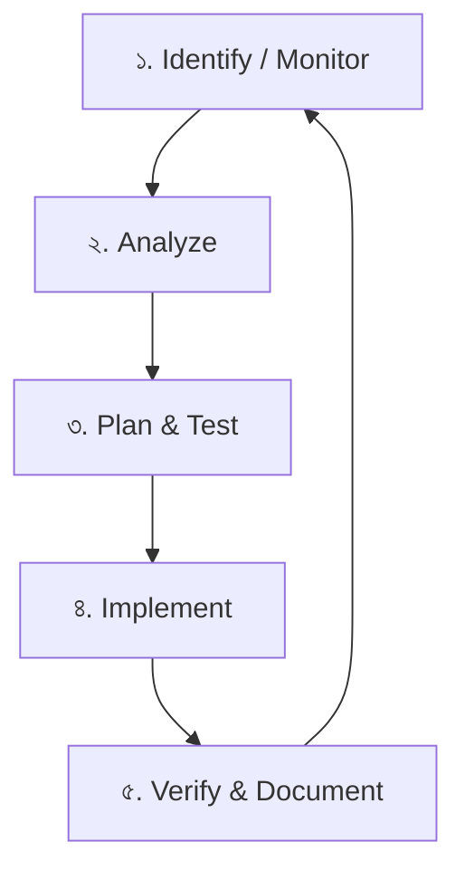
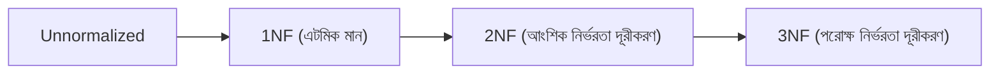
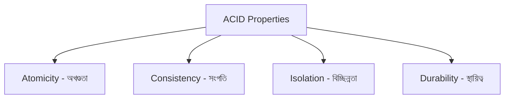

# Tech Concepts Q&A 2 (স্টাডি নোটস - পার্ট ২)

এখানে আপনার আলোচনার বিশেষ টপিকগুলো (প্রশ্ন ৩৪ ও ৩৫) আলাদা করে রাখা হলো।

---

**প্রশ্ন ৩৪: SQL-এ Index (ইনডেক্স) কী? এটি কেন ব্যবহার করা হয় এবং এর প্রকারভেদগুলো কী কী? (বিস্তারিত ব্যাখ্যাসহ)**

**উত্তর:**
**Index (ইনডেক্স)** হলো ডেটাবেসের পারফরম্যান্স অপ্টিমাইজ করার একটি অন্যতম শক্তিশালী মেকানিজম। 

সহজ ভাষায়, একটি বড় বইয়ের শেষে যেমন একটি সূচিপত্র বা **Index** থাকে, যার মাধ্যমে পুরো বই না খুঁজে সরাসরি সুনির্দিষ্ট পৃষ্ঠায় চলে যাওয়া যায়; ঠিক তেমনি ডেটাবেস ইনডেক্সিংয়ের মাধ্যমে পুরো টেবিল স্ক্যান (Table Scan) না করে খুব দ্রুত ডেটা খুঁজে বের করা যায়।

**ইনডেক্স ব্যবহারের ভালো ও মন্দ দিক:**
*   **সুবিধা (Pros):** ডেটা রিট্রিভ বা সার্চ করার স্পিড অনেক গুণ বেড়ে যায় (SELECT কুয়েরি ফাস্ট হয়)।
*   **অসুবিধা (Cons):** 
    ১. ইনডেক্স মেমরিতে অতিরিক্ত জায়গা দখল করে।
    ২. `INSERT`, `UPDATE` এবং `DELETE` (DML) অপারেশনগুলো কিছুটা স্লো হয়ে যায়, কারণ প্রতিবার ডেটা পরিবর্তনের সাথে সাথে ইনডেক্সও নতুন করে আপডেট করতে হয়।

---

### SQL-এ ইনডেক্সের প্রধান প্রকারভেদসমূহ:

১. **Clustered Index (ক্লাস্টার্ড ইনডেক্স):**
*   **কাজ:** এটি টেবিলের ডেটাগুলোকে ফিজিক্যালি (মেমরিতে) কীভাবে সাজানো বা সর্ট করা থাকবে তা নির্ধারণ করে। 
*   **নিয়ম:** একটি টেবিলে কেবল **একটিই** Clustered Index থাকতে পারে (যেমন একটি ডিকশনারিতে শব্দগুলো ফিজিক্যালি বর্ণানুক্রমিকভাবে সাজানো থাকে)।
*   **তৈরি:** টেবিলে `PRIMARY KEY` তৈরি করলে ডেটাবেস অটোমেটিক্যালি ওই কলামের ওপর একটি Clustered Index তৈরি করে নেয়।

২. **Non-Clustered Index (নন-ক্লাস্টার্ড ইনডেক্স):**
*   **কাজ:** এটি টেবিলের ফিজিক্যাল ডেটা সর্ট করে না। এটি আলাদা জায়গায় ইনডেক্সের একটি তালিকা এবং আসল ডেটাটি কোন জায়গায় (Row location/Pointer) আছে তার একটি পয়েন্টার জমা রাখে (যেমন বইয়ের পেছনের ইনডেক্স পাতা)।
*   **নিয়ম:** একটি টেবিলে একাধিক (SQL Server-এ ৯৯৯টি পর্যন্ত) Non-Clustered Index থাকতে পারে।
*   **সিনট্যাক্স:**
```sql
CREATE INDEX IX_Students_City ON Students(City);
```

৩. **Unique Index (ইউনিক ইনডেক্স):**
*   **কাজ:** এটি নিশ্চিত করে যে ইনডেক্স করা কলামটিতে কোনো ডুপ্লিকেট ডেটা ঢুকতে পারবে না।
*   **তৈরি:** টেবিলে `UNIQUE` কনস্ট্রেইন্ট ব্যবহার করলে অটোমেটিক Unique Index তৈরি হয়। অথবা ম্যানুয়ালি তৈরি করা যায়:
```sql
CREATE UNIQUE INDEX UIX_Students_Email ON Students(Email);
```
*   **Non-Unique Index (নন-ইউনিক ইনডেক্স):** এটিই মূলত ডেটাবেসের **ডিফল্ট ইনডেক্স**। যখন আমরা সাধারণ উপায়ে ইনডেক্স তৈরি করি (যেমন ২ নম্বরে দেখানো `CREATE INDEX IX_Students_City...`), তখন তা নন-ইউনিক ইনডেক্স হিসেবে তৈরি হয়। এটি কলামে ডুপ্লিকেট মান (যেমন একই সিটিতে একাধিক স্টুডেন্ট) রাখার অনুমতি দেয়।


৪. **Composite Index (কম্পোজিট ইনডেক্স):**
*   **কাজ:** যখন একাধিক কলামের ওপর ভিত্তি করে একটি ইনডেক্স তৈরি করা হয়, তখন তাকে Composite Index বলে।
*   **কখন লাগে:** যদি কুয়েরির WHERE ক্লজে সাধারণত দুটি কলাম একসাথে ফিল্টার করা হয় (যেমন: First Name এবং Last Name)।
```sql
CREATE INDEX IX_Students_FullName ON Students(FirstName, LastName);
```

৫. **Filtered Index (ফিল্টার্ড ইনডেক্স):**
*   **কাজ:** পুরো টেবিলের ওপর ইনডেক্স তৈরি না করে, শুধুমাত্র নির্দিষ্ট কন্ডিশন বা রোর ওপর ভিত্তি করে ইনডেক্স তৈরি করা। এতে ইনডেক্সের সাইজ অনেক ছোট থাকে।
*   **সিনট্যাক্স:**
```sql
CREATE INDEX IX_ActiveStudents ON Students(StudentID) WHERE Status = 'Active';
```

৬. **Covering Index (কভারিং ইনডেক্স):**
*   **কাজ:** এটি কোনো আলাদা টাইপ নয়, বরং একটি ব্যবহারের টেকনিক। কোনো কুয়েরির জন্য প্রয়োজনীয় **সবগুলো কলামই** যদি একটি Non-Clustered ইনডেক্সের ভেতরেই উপস্থিত থাকে (ইনডেক্স কি এবং INCLUDE ক্লজের মাধ্যমে), তবে ডেটাবেস ইঞ্জিনকে আর ফিজিক্যাল টেবিলে ফিরে যেতে হয় না। একে Covering Index বলে।

---

**প্রশ্ন ৩৫: SQL / ডেটাবেস-এ Performance Optimization-এর লাইফসাইকেল (Lifecycle) বা ধাপগুলো কী কী?**

**উত্তর:**
ডেটাবেস পারফরম্যান্স অপ্টিমাইজেশন কোনো এককালীন কাজ নয়। এটি একটি চলমান চক্র বা **Performance Optimization Lifecycle**। যখন কোনো প্রোডাকশন সিস্টেমের কুয়েরি বা ডেটাবেস স্লো হয়ে যায়, তখন সিস্টেমকে পুনরায় ফাস্ট করার জন্য এই লাইফসাইকেলটি অনুসরণ করা হয়। 

এর প্রধান ৫টি ধাপ নিচে আলোচনা করা হলো:



#### ১. Identify / Monitor (শনাক্তকরণ ও পর্যবেক্ষণ)
*   **কাজ:** প্রথমে সিস্টেমের কোথায় সমস্যা বা কোন কোন কুয়েরিগুলো স্লো কাজ করছে (Slow-running Queries) তা পর্যবেক্ষণ ও শনাক্ত করা। 
*   **কীভাবে করা হয়:** ডেটাবেসের নিজস্ব মনিটরিং টুলস ব্যবহার করে এটি করা হয়।
    *   *SQL Server:* SQL Server Profiler, Extended Events, Query Store বা DMV (Dynamic Management Views)।
    *   *APM Tools:* New Relic, Datadog ইত্যাদি ব্যবহার করে স্লো কুয়েরি বের করা।

#### ২. Analyze (বিশ্লেষণ)
*   **কাজ:** স্লো কুয়েরিগুলো খুঁজে পাওয়ার পর বিশ্লেষণ করা যে— কেন এগুলো স্লো? ডেটাবেস ব্যাকগ্রাউন্ডে কীভাবে ডেটা খুঁজছে?
*   **কীভাবে করা হয়:**
    *   **Execution Plan** দেখা: ডেটাবেস কি ইনডেক্স ব্যবহার করছে (Index Seek) নাকি পুরো টেবিল স্ক্যান (Table Scan) করছে?
    *   **Resource Bottleneck:** সিপিইউ (CPU), মেমরি (RAM), নাকি ডিস্ক রিড/রাইট (I/O) এর কারণে স্লো হচ্ছে তা দেখা।
    *   **Statistics:** ডেটাবেসের স্ট্যাটিস্টিকস আপডেট আছে কিনা চেক করা।

#### ৩. Plan & Test (পরিকল্পনা ও পরীক্ষা)
*   **কাজ:** বিশ্লেষণ শেষে কীভাবে সমাধান করা যায় তার প্ল্যান তৈরি করা এবং তা ডেভেলপমেন্ট/স্টেজ এনভায়রনমেন্টে টেস্ট করা। সরাসরি প্রোডাকশন ডেটাবেসে কোনো পরিবর্তন করা যাবে না।
*   **অপ্টিমাইজেশনের প্রধান টেকনিকসমূহ:**
    *   **Index Tuning:** নতুন Non-Clustered Index তৈরি করা, Covering Index ব্যবহার করা, অথবা অব্যবহৃত ইনডেক্স ফেলে দেওয়া।
    *   **Query Rewriting:** সাবকোয়েরির বদলে `JOIN` ব্যবহার করা, `UNION` এর বদলে `UNION ALL` (যদি ডুপ্লিকেট না লাগে), অথবা `SELECT *` এর বদলে সুনির্দিষ্ট কলাম সিলেক্ট করা।
    *   **Avoiding N+1 Query Problem:** ORM (যেমন EF Core) ব্যবহার করার সময় Eager Loading (`.Include()`) ব্যবহার করা, যাতে লুপের ভেতরে বারবার কুয়েরি না চলে।
    *   **Batching & Pagination:** একসাথে লাখ লাখ ডেটা লোড না করে `OFFSET-FETCH` বা Keyset Pagination ব্যবহার করে ধাপে ধাপে ডেটা লোড করা।
    *   **Denormalization:** খুব বেশি JOIN এড়াতে ডিজাইন পরিবর্তন করে কিছু গুরুত্বপূর্ণ ডেটা ডুপ্লিকেট করে এক টেবিলে রাখা।
    *   **Caching:** ঘন ঘন কল হওয়া এবং কম পরিবর্তিত হওয়া ডেটা মেমরিতে (যেমন Redis Cache) ক্যাশ করে রাখা।
    *   **Database maintenance (ইনডেক্স রি-বিল্ড ও স্ট্যাটিস্টিকস):** নিয়মিত ইনডেক্স ডিফ্র্যাগমেন্ট (Index Defragmentation) করা এবং Statistics আপডেট রাখা।
    *   **Connection Pooling:** প্রতিবার নতুন কানেকশন তৈরি না করে কানেকশন pool ব্যবহার করা।
    *   **Partitioning/Sharding:** টেবিল অনেক বড় হলে ডেটা ভাগ করে নেওয়া।
*   **পরীক্ষা:** স্টেজ সার্ভারে পরিবর্তন করে কুয়েরির execution time এবং logical reads-এর সংখ্যা কমেছে কিনা তা যাচাই করা।

#### ৪. Implement (বাস্তবায়ন)
*   **কাজ:** টেস্ট এনভায়রনমেন্টে আশানুরূপ রেজাল্ট পাওয়ার পর তা প্রোডাকশন সার্ভারে ডিপ্লয় বা রিলিজ করা।
*   **সতর্কতা:** ইনডেক্স তৈরি বা বড় কুয়েরি আপডেট করার কাজগুলো সাধারণত **Off-Peak Hours** (যখন সিস্টেমে ইউজার ট্রাফিক সবচেয়ে কম থাকে, যেমন রাতে বা ছুটির দিনে) এ করা উচিত, যাতে চলমান ইউজারের কাজে ব্যাঘাত না ঘটে।

#### ৫. Verify & Document (যাচাইকরণ ও নথিপত্র তৈরি)
*   **কাজ:** বাস্তবায়নের পর প্রোডাকশনে পারফরম্যান্স আসলেই ইম্প্রুভ হয়েছে কিনা তা লাইভ মনিটর করা এবং করা কাজগুলো লিখে রাখা।
*   **Verify:** আগের তুলনায় কুয়েরির এক্সিকিউশন টাইম (Execution Time) এবং রিসোর্স ইউসেজ কমেছে কিনা তা প্রফাইল টুলের মাধ্যমে কনফার্ম করা।
*   **Document:** কি সমস্যা ছিল, কি অপ্টিমাইজেশন বা ইনডেক্স অ্যাড করা হয়েছে এবং এর ফলে কত পারসেন্ট স্পিড বেড়েছে তা অডিট ট্রেইল হিসেবে ডক ফাইল আকারে রাখা।

---

**প্রশ্ন ৩৬: SQL / ডেটাবেস-এ Normalization (নরমালাইজেশন) কী? 1NF, 2NF, 3NF বিস্তারিত উদাহরণসহ আলোচনা করো।**

**উত্তর:**
**Normalization (নরমালাইজেশন)** হলো ডেটাবেস ডিজাইন করার এমন একটি লজিক্যাল প্রক্রিয়া বা পদ্ধতি যার মাধ্যমে ডেটার অনাবশ্যক পুনরাবৃত্তি বা ডুপ্লিকেশন (Data Redundancy) কমানো যায় এবং ডেটার অখণ্ডতা (Data Integrity) রক্ষা করা যায়। 

সহজ কথায়, একটি বড় টেবিলকে ভেঙে লজিক্যালি সম্পর্কিত একাধিক ছোট ছোট টেবিলে রূপান্তর করা এবং টেবিলগুলোর মধ্যে সম্পর্ক (Primary Key - Foreign Key) তৈরি করাই হলো নরমালাইজেশন।

#### কেন নরমালাইজেশন প্রয়োজন? (Database Anomalies)
নরমালাইজেশন না করলে ডেটাবেসে প্রধানত ৩ ধরনের সমস্যা দেখা দেয়, যাদেরকে **Anomalies** বলা হয়:
১. **Insertion Anomaly (ঢোকানোর সমস্যা):** কোনো নতুন তথ্য অন্য কোনো তথ্যের অনুপস্থিতির কারণে টেবিলে ইনসার্ট করতে না পারা। (যেমন: কোনো ডিপার্টমেন্টে নতুন শিক্ষক যোগ দিলে, কোনো স্টুডেন্ট ভর্তি না হওয়া পর্যন্ত শিক্ষকের তথ্য সেভ করতে না পারা)।
২. **Update Anomaly (আপডেটের সমস্যা):** একই তথ্য একাধিক জায়গায় ডুপ্লিকেট থাকার কারণে এক জায়গায় আপডেট করলে অন্য জায়গায় তা পুরোনো থেকে যাওয়া। (যেমন: একজন ইউজারের ঠিকানা পরিবর্তন হলে সব রো-তে তা আপডেট না করা, ফলে ডেটার অমিল দেখা দেয়)।
৩. **Deletion Anomaly (মুছে ফেলার সমস্যা):** একটি রেকর্ড ডিলিট করার ফলে অন্য কোনো গুরুত্বপূর্ণ তথ্য অনিচ্ছাকৃতভাবে চিরতরে হারিয়ে যাওয়া। (যেমন: একজন স্টুডেন্ট বিদায় নিলে তার পুরো রেকর্ড ডিলিট করার সাথে সাথে ওই কোর্সের তথ্যও ডিলিট হয়ে যাওয়া)।

---

### Normal Forms (নরমাল ফর্মসমূহ) ও ধাপসমূহ:



#### ১. 1st Normal Form (1NF) - প্রথম নরমাল ফর্ম
*   **শর্ত:**
    *   টেবিলের প্রতিটি সেলে কেবল একটি একক বা **এটমিক মান (Atomic Value/Single Value)** থাকতে হবে।
    *   কোনো কলামে কমা দিয়ে একাধিক মান বা কোনো ডেটার গ্রুপ রাখা যাবে না।
    *   প্রতিটি রো (Row) অবশ্যই ইউনিক হতে হবে।

*   **সমস্যাযুক্ত টেবিল (Unnormalized):**
    | StudentID | Name | Phone |
    | :--- | :--- | :--- |
    | 1 | Rahim | 01711..., 01822... |
    | 2 | Karim | 01933... |
    *(এখানে ১ নম্বর স্টুডেন্টের Phone কলামে কমা দিয়ে দুটি নম্বর দেওয়া আছে, যা 1NF লঙ্ঘন করে)*

*   **সমাধান (1NF টেবিল):**
    | StudentID | Name | Phone |
    | :--- | :--- | :--- |
    | 1 | Rahim | 01711... |
    | 1 | Rahim | 01822... |
    | 2 | Karim | 01933... |

---

#### ২. 2nd Normal Form (2NF) - দ্বিতীয় নরমাল ফর্ম
*   **শর্ত:**
    *   টেবিলটিকে অবশ্যই **1NF**-এ থাকতে হবে।
    *   কোনো নন-প্রাইমারি কী কলাম (Non-key Column) প্রাইমারি কী-এর কোনো অংশের ওপর নির্ভরশীল হতে পারবে না। অর্থাৎ, টেবিলে যদি **Composite Primary Key** (একাধিক কলামের প্রাইমারি কী) থাকে, তবে নন-কী কলামগুলোকে সম্পূর্ণ প্রাইমারি কী-এর ওপর নির্ভর করতে হবে, আংশিক (Partial) অংশের ওপর নয়। (একে **No Partial Dependency** বলা হয়)।

*   **সমস্যাযুক্ত টেবিল (1NF-এ আছে কিন্তু 2NF-এ নেই):**
    ধরুন একটি `CourseEnrollment` টেবিল যেখানে প্রাইমারি কী হলো Composite Key: `(StudentID, CourseID)`।
    | StudentID (PK) | CourseID (PK) | CourseName | Fees |
    | :--- | :--- | :--- | :--- |
    | 1 | C101 | C# Basic | 5000 |
    | 2 | C101 | C# Basic | 5000 |
    | 1 | C102 | SQL Server | 4000 |
    *(এখানে `CourseName` কিন্তু শুধু `CourseID` এর ওপর নির্ভর করে, `StudentID` এর সাথে এর কোনো সম্পর্ক নেই। এটিই হলো Partial Dependency)*

*   **সমাধান (2NF টেবিল):** টেবিলটিকে ভেঙে দুটি টেবিলে ভাগ করতে হবে:
    *   **Courses টেবিল (CourseID প্রাইমারি কী):**
        | CourseID (PK) | CourseName | Fees |
        | :--- | :--- | :--- |
        | C101 | C# Basic | 5000 |
        | C102 | SQL Server | 4000 |
    
    *   **Enrollment টেবিল (StudentID, CourseID কম্পোজিট কী):**
        | StudentID (PK) | CourseID (FK) |
        | :--- | :--- |
        | 1 | C101 |
        | 2 | C101 |
        | 1 | C102 |

---

#### ৩. 3rd Normal Form (3NF) - তৃতীয় নরমাল ফর্ম
*   **শর্ত:**
    *   টেবিলটিকে অবশ্যই **2NF**-এ থাকতে হবে।
    *   কোনো নন-প্রাইমারি কী কলাম অন্য কোনো নন-প্রাইমারি কী কলামের ওপর নির্ভরশীল হতে পারবে না। অর্থাৎ, টেবিলে কোনো **Transitive Dependency** থাকতে পারবে না। 
    *   সহজ কথায়: যদি A -> B এবং B -> C হয়, তবে A -> C সরাসরি হতে পারবে না। (নন-কী কলাম যেন অন্য নন-কী কলামকে নির্দেশ না করে)।

*   **সমস্যাযুক্ত টেবিল (2NF-এ আছে কিন্তু 3NF-এ নেই):**
    ধরি `Students` টেবিল যেখানে প্রাইমারি কী হলো `StudentID`।
    | StudentID (PK) | Name | ZipCode | City |
    | :--- | :--- | :--- | :--- |
    | 1 | Rahim | 1207 | Dhaka |
    | 2 | Karim | 3100 | Sylhet |
    *(এখানে `City` কলামটি সরাসরি `StudentID` এর ওপর নির্ভর করে না, এটি নির্ভর করে `ZipCode` এর ওপর। কিন্তু `ZipCode` নিজে কোনো প্রাইমারি কী নয়। অর্থাৎ StudentID -> ZipCode -> City। এটিই হলো Transitive Dependency)*

*   **সমাধান (3NF টেবিল):** টেবিলটিকে ভেঙে দুভাগে ভাগ করতে হবে:
    *   **Students টেবিল:**
        | StudentID (PK) | Name | ZipCode (FK) |
        | :--- | :--- | :--- |
        | 1 | Rahim | 1207 |
        | 2 | Karim | 3100 |
    
    *   **ZipLocations টেবিল:**
        | ZipCode (PK) | City |
        | :--- | :--- |
        | 1207 | Dhaka |
        | 3100 | Sylhet |

---

**প্রশ্ন ৩৭: SQL Transaction কী? Transaction-এর ACID Properties বলতে কী বোঝায়? বিস্তারিত আলোচনা করো।**

**উত্তর:**
### SQL Transaction (ট্রানজেকশন) কী?
**Transaction (ট্রানজেকশন)** হলো এক বা একাধিক SQL কুয়েরি বা ডেটাবেস অপারেশনের সমন্বয়ে গঠিত একটি লজিক্যাল কাজের ইউনিট (Logical Unit of Work)। 

ট্রানজেকশনের মূল লজিক হলো— **"সব হবে অথবা কিছুই হবে না" (All or Nothing)**। অর্থাৎ, ট্রানজেকশনের ভেতরের প্রতিটি অপারেশন বা কোয়েরি যদি সফলভাবে সম্পন্ন হয়, তবেই পুরো কাজটি ডেটাবেসে স্থায়ীভাবে সেভ হবে। যদি কোনো একটি কোয়েরিও ফেইল করে, তবে সম্পূর্ণ ট্রানজেকশনটি বাতিল হয়ে যাবে এবং ডেটাবেস পূর্বের অবস্থায় ফিরে যাবে।

#### ট্রানজেকশন কন্ট্রোল কমান্ড (TCL Commands):
SQL-এ ট্রানজেকশন পরিচালনা করার জন্য মূলত ৪টি কমান্ড ব্যবহার করা হয়:
১. **BEGIN TRANSACTION:** একটি নতুন ট্রানজেকশন শুরু করার জন্য এটি ব্যবহার করা হয়।
২. **COMMIT:** ট্রানজেকশনের ভেতরের সব অপারেশন সফলভাবে শেষ হলে ডেটা স্থায়ীভাবে ডেটাবেসে সেভ (Save) করার জন্য এটি চালানো হয়।
৩. **ROLLBACK:** ট্রানজেকশনের কোনো অংশে এরর বা সমস্যা দেখা দিলে ডেটাবেসকে ট্রানজেকশন শুরুর আগের অবস্থায় ফিরিয়ে নিয়ে যাওয়ার জন্য এটি ব্যবহার করা হয়।
৪. **SAVEPOINT:** ট্রানজেকশনের মাঝে কোনো নির্দিষ্ট ধাপে একটি বুকমার্ক বা পয়েন্ট তৈরি করা। কোনো সমস্যা হলে পুরো ট্রানজেকশন রোলব্যাক না করে শুধুমাত্র নির্দিষ্ট SAVEPOINT পর্যন্ত রোলব্যাক করা যায়।

#### রিয়েল-লাইফ উদাহরণ (ব্যাংক ফান্ড ট্রান্সফার):
ধরুন, রহিম তার অ্যাকাউন্ট থেকে করিমকে ৫০০ টাকা পাঠাবে। এখানে ডেটাবেসে দুটি কাজ করতে হবে:
১. রহিমের অ্যাকাউন্টের ব্যালেন্স ৫০০ টাকা কমাতে হবে (`UPDATE Accounts SET Balance = Balance - 500 WHERE User = 'Rahim'`)।
২. করিমের অ্যাকাউন্টের ব্যালেন্স ৫০০ টাকা বাড়াতে হবে (`UPDATE Accounts SET Balance = Balance + 500 WHERE User = 'Karim'`)।

*সমস্যা:* যদি প্রথম কোয়েরিটি চলার পর বিদ্যুৎ চলে যায় বা সার্ভার ডাউন হয়ে যায়, তবে রহিমের ৫০০ টাকা কেটে নেওয়া হবে কিন্তু করিম তা পাবে না। 
*সমাধান (Transaction):* এই দুটি কোয়েরিকে একটি Transaction-এর ভেতরে রাখা হয়। ফলে দুটির যেকোনো একটি ফেইল করলে ডেটাবেস `ROLLBACK` হয়ে রহিমের ৫০০ টাকা আবার তার অ্যাকাউন্টে ফেরত চলে যাবে। দুটিই সফল হলে তবেই `COMMIT` হবে।

---

### ACID Properties (এসিড প্রোপার্টিজ) কী?
ডেটাবেসে যেকোনো ট্রানজেকশনের স্থায়িত্ব, নির্ভরযোগ্যতা এবং ডেটার নির্ভুলতা (Data Integrity) নিশ্চিত করার জন্য ৪টি মূল নীতি বা নিয়ম মেনে চলতে হয়। এদের প্রথম অক্ষরগুলো নিয়ে গঠিত হয়েছে **ACID**:



#### ১. Atomicity (অখণ্ডতা - All or Nothing)
*   **ব্যাখ্যা:** ট্রানজেকশনের সব কাজ একটি একক ইউনিট হিসেবে গণ্য হবে। হয় পুরো কাজ সম্পন্ন হবে, না হয় একদমই হবে না। অর্ধেক কাজ হয়ে বন্ধ থাকা যাবে না। কোনো একটি কোয়েরি এরর দিলে পুরো কাজ বাতিল (Rollback) হবে।

#### ২. Consistency (সংগতি - Valid State)
*   **ব্যাখ্যা:** একটি ট্রানজেকশন শুরু হওয়ার আগে এবং শেষ হওয়ার পরে ডেটাবেস যেন সবসময় একটি সঠিক ও লজিক্যাল স্টেট-এ (Valid State) থাকে। ডেটাবেসের ডিফাইন করা সব কনস্ট্রেইন্ট বা নিয়ম অপরিবর্তিত থাকবে।
*   *উদাহরণ:* রহিমের অ্যাকাউন্টে মাত্র ৩০০ টাকা আছে, কিন্তু সে করিমকে ৫০০ টাকা পাঠাতে পারবে না কারণ ডেটাবেসের নিয়ম (Balance >= 0) লঙ্ঘন হবে। 

#### ৩. Isolation (বিচ্ছিন্নতা - Independence)
*   **ব্যাখ্যা:** একই সময়ে ডেটাবেসে একাধিক ট্রানজেকশন চলতে পারে। Isolation নিশ্চিত করে যে, প্রতিটি ট্রানজেকশন এমনভাবে চলবে যেন তারা একে অপরের থেকে সম্পূর্ণ আলাদা ও বিচ্ছিন্ন। একটি ট্রানজেকশনের অসমাপ্ত বা অন্তর্বর্তীকালীন ডেটা অন্য ট্রানজেকশন দেখতে পারবে না (প্রিভেন্ট ডার্টি রিড)।
*   *উদাহরণ:* রহিম করিমকে টাকা পাঠানোর ট্রানজেকশনটি চলাকালীন, অন্য কেউ করিমের অ্যাকাউন্টে ব্যালেন্স চেক করলে রহিম টাকা পাঠানোর আগের পুরোনো ব্যালেন্সই দেখবে, যতক্ষণ না রহিমের ট্রানজেকশনটি পুরোপুরি COMMIT হচ্ছে।

#### ৪. Durability (স্থায়িত্ব - Permanent)
*   **ব্যাখ্যা:** ট্রানজেকশন একবার সফলভাবে সম্পন্ন (COMMIT) হয়ে গেলে, সেই ডেটা স্থায়ীভাবে ডেটাবেসে সেভ হয়ে যাবে। এরপর সার্ভার ডাউন, বিদ্যুৎ চলে যাওয়া বা সিস্টেম ক্র্যাশ করলেও ডেটাবেস থেকে ওই ডেটা আর হারিয়ে যাবে না।

---

**প্রশ্ন ৩৮: SQL Server-এ Error Handling বা TRY...CATCH কীভাবে কাজ করে? একটি স্টোরড প্রসিডিউর ও ট্রানজেকশনের মাধ্যমে উদাহরণ দাও।**

**উত্তর:**
### SQL-এ Error Handling এবং TRY...CATCH কী?
SQL Server-এ কোড বা কুয়েরি রান করার সময় কোনো অপ্রত্যাশিত ত্রুটি বা ভুল (যেমন: ০ দিয়ে ভাগ করা, ইউনিক প্রাইমারি কী ভায়োলেশন, ফরেন কী মিসম্যাচ ইত্যাদি) হলে স্বাভাবিক ডেটাবেস রান বন্ধ হয়ে যায় এবং এরর মেসেজ দেয়। 

এই ধরনের ভুলগুলোকে প্রোগ্রামিং ল্যাঙ্গুয়েজের মতো সুন্দরভাবে হ্যান্ডেল বা নিয়ন্ত্রণ করার পদ্ধতিই হলো **Error Handling**। SQL Server 2005 থেকে এর জন্য **TRY...CATCH** ব্লক ব্যবহার করা হয়।

#### TRY...CATCH এর বেসিক স্ট্রাকচার:
```sql
BEGIN TRY
    -- ১. যে কোডগুলো রান করতে চান এবং যেখানে এরর হওয়ার সম্ভাবনা আছে
END TRY
BEGIN CATCH
    -- ২. যদি TRY ব্লকে কোনো এরর হয়, তবে কোড সরাসরি এখানে চলে আসবে
    -- ৩. এখানে আমরা এরর লগ রাখতে পারি, রোলব্যাক করতে পারি বা কাস্টম মেসেজ দিতে পারি
END CATCH
```

---

### CATCH ব্লকের বিল্ট-ইন এরর ফাংশনসমূহ:
CATCH ব্লকের ভেতরে এররের সুনির্দিষ্ট বিবরণ জানার জন্য SQL Server-এ বেশ কিছু চমৎকার বিল্ট-ইন ফাংশন রয়েছে:
১. **ERROR_NUMBER():** এররের সুনির্দিষ্ট আইডি নাম্বার রিটার্ন করে।
২. **ERROR_MESSAGE():** এররটির মূল কারণ বা মেসেজ টেক্সট দেখায়।
৩. **ERROR_SEVERITY():** এররের তীব্রতা বা গ্র্যাভিটি লেভেল (Severity level - ১ থেকে ২৬) দেখায়।
৪. **ERROR_STATE():** এররের স্টেট নাম্বার দেখায়।
৫. **ERROR_LINE():** কোডের ঠিক কত নাম্বার লাইনে এররটি ঘটেছে তা নির্দিষ্ট করে।
৬. **ERROR_PROCEDURE():** যদি কোনো Stored Procedure-এর ভেতরে এররটি ঘটে, তবে সেই প্রসিডিউরের নাম দেখায়।

---

### বাস্তব উদাহরণ (Stored Procedure ও Transaction-এর সাথে TRY...CATCH):
ধরি, আমাদের একটি প্রোডাক্ট ইনভেন্টরি টেবিল আছে যেখানে নতুন প্রোডাক্ট ঢোকানোর সময় যদি কোনো এরর হয় (যেমন: ডুপ্লিকেট প্রোডাক্ট আইডি), তবে ডেটাবেস যেন ক্র্যাশ না করে এবং ট্রানজেকশন যেন সঠিক নিয়মে রোলব্যাক হয়:

```sql
-- Stored Procedure তৈরি করা হচ্ছে
CREATE PROCEDURE sp_InsertProduct
    @ProductID INT,
    @ProductName VARCHAR(50),
    @Price DECIMAL(18,2)
AS
BEGIN
    -- ট্রানজেকশন এবং ট্রাই ব্লক শুরু
    BEGIN TRY
        BEGIN TRANSACTION;
        
        -- প্রোডাক্ট টেবিলে ইনসার্ট করছি
        INSERT INTO Products (ProductID, ProductName, Price)
        VALUES (@ProductID, @ProductName, @Price);
        
        -- সব সফল হলে স্থায়ীভাবে সেভ
        COMMIT TRANSACTION;
        PRINT 'Product inserted successfully!';
    END TRY
    
    -- যদি ইনসার্ট করতে গিয়ে কোনো এরর হয় (যেমন: Duplicate ProductID)
    BEGIN CATCH
        -- ১. ট্রানজেকশন সফল না হলে তা বাতিল (Rollback) করছি
        IF @@TRANCOUNT > 0
        BEGIN
            ROLLBACK TRANSACTION;
        END
        
        -- ২. কাস্টম এরর মেসেজ দেখাচ্ছি
        PRINT 'An error occurred during insertion!';
        SELECT 
            ERROR_NUMBER() AS ErrorNumber,
            ERROR_MESSAGE() AS ErrorMessage,
            ERROR_LINE() AS ErrorLine,
            ERROR_PROCEDURE() AS ErrorProcedure;
    END CATCH
END;
```

```sql
-- Stored Procedure টি চালানো
*ফায়দা:* যদি একই আইডি ১০১ দিয়ে আবার কল করা হয়, তবে ডেটাবেস ট্রানজেকশনটি রোলব্যাক করবে এবং CATCH ব্লকে গিয়ে ডুপ্লিকেট কী এররের বিবরণ সুন্দরভাবে প্রিন্ট করে দেখাবে।

---

**প্রশ্ন ৩৯: SQL Server-এ Stored Procedure-এর ভেতর Transactions-এর সাথে TRY...CATCH ব্যবহার করার স্ট্যান্ডার্ড ও বেস্ট প্র্যাকটিস প্যাটার্নটি কী? (XACT_STATE() সহ ব্যাখ্যা)**

**উত্তর:**
ডেটাবেসে Transactions এবং TRY...CATCH একসাথে ব্যবহার করা অত্যন্ত গুরুত্বপূর্ণ। এর উদ্দেশ্য হলো— ট্রানজেকশনের ভেতরে কোনো ভুল বা এক্সেপশন হলে ডেটাবেস যেন কোনোভাবেই লক বা ঝুলন্ত (Orphaned Transaction) অবস্থায় না থাকে এবং সম্পূর্ণ ডেটা যেন রোলব্যাক হয়ে যায়।

### বেস্ট প্র্যাকটিস ও স্ট্যান্ডার্ড টেমপ্লেট:
উন্নত ও প্রোডাকশন গ্রেড ডেটাবেস ডিজাইনে শুধুমাত্র `@@TRANCOUNT` ব্যবহার না করে **`XACT_STATE()`** ফাংশনটি ব্যবহার করা সবচেয়ে নিরাপদ।

#### `XACT_STATE()` কী এবং কেন গুরুত্বপূর্ণ?
SQL Server-এ কোনো এরর ঘটলে অনেক সময় ট্রানজেকশনটি এমন অবস্থায় চলে যায় যে তা আর কমিট করা সম্ভব হয় না (একে **Uncommittable Transaction** বলে)। এমতাবস্থায় আপনি জোর করে Commit করতে গেলে ডেটাবেস নতুন এরর দেবে। `XACT_STATE()` মূলত ৩টি স্টেট দেয়:
*   **১ (1):** ট্রানজেকশনটি সচল আছে এবং এটি সফলভাবে **Commit** করা যাবে।
*   **-১ (-1):** ট্রানজেকশনটি সচল আছে কিন্তু এটি **Uncommittable** (কমিট করা সম্ভব নয়)। এটিকে অবশ্যই **Rollback** করতে হবে।
*   **০ (0):** বর্তমানে কোনো সচল ট্রানজেকশন নেই।

---

### প্রোডাকশন-গ্রেড স্ট্যান্ডার্ড ট্রানজেকশন টেমপ্লেট:

নিচে Transactions এবং TRY...CATCH ব্যবহারের আদর্শ কোড টেমপ্লেট দেওয়া হলো যা যেকোনো প্রজেক্টে ব্যবহার করা যায়:

```sql
CREATE PROCEDURE sp_ComplexTransactionDemo
AS
BEGIN
    -- ১. অতিরিক্ত মেসেজ পাঠানো বন্ধ রাখা (পারফরম্যান্সের জন্য)
    SET NOCOUNT ON;

    -- ২. ট্রাই ব্লক শুরু
    BEGIN TRY
        -- ৩. ট্রানজেকশন শুরু
        BEGIN TRANSACTION;

        -- ==========================================
        -- এখানে আপনার মূল SQL কুয়েরিগুলো লিখবেন
        -- কুয়েরি ১: UPDATE ...
        -- কুয়েরি ২: INSERT ...
        -- ==========================================

        -- ৪. সব কাজ সফল হলে ট্রানজেকশন কমিট করা
        COMMIT TRANSACTION;
        PRINT 'Transaction Committed Successfully!';
    END TRY
    
    -- ৫. ক্যাচ ব্লক শুরু (এরর হ্যান্ডলিং)
    BEGIN CATCH
        -- ৬. চেক করা যে কোনো সচল ট্রানজেকশন আছে কিনা
        -- XACT_STATE() = -1 বা 1 হলে রোলব্যাক করা যাবে
        IF XACT_STATE() <> 0
        BEGIN
            ROLLBACK TRANSACTION;
            PRINT 'Transaction Rolled Back!';
        END

        -- ৭. এররের তথ্য সংরক্ষণ বা প্রিন্ট করা
        DECLARE @ErrorMessage NVARCHAR(4000) = ERROR_MESSAGE();
        DECLARE @ErrorSeverity INT = ERROR_SEVERITY();
        DECLARE @ErrorState INT = ERROR_STATE();

        -- ৮. এররটি পুনরায় থ্রো (Throw) করা যাতে ক্লায়েন্ট অ্যাপ্লিকেশন (যেমন .NET backend) এররটি বুঝতে পারে
        THROW @ErrorNumber, @ErrorMessage, @ErrorState; 
        
        -- (নোট: SQL Server 2012+ এ THROW কিওয়ার্ড ব্যবহার করা বেস্ট প্র্যাকটিস)
    END CATCH
END;
```

### কেন এই প্যাটার্নটি সেরা?
১. **লক হওয়া প্রতিরোধ করে:** `CATCH` ব্লকে `XACT_STATE()` চেক করে নিশ্চিত হওয়া যায় যে ট্রানজেকশনটি সচল আছে কিনা, তারপরই কেবল রোলব্যাক করা হয়। ফলে "রোলব্যাক করার কোনো ট্রানজেকশন নেই" এমন নতুন এরর হওয়া বন্ধ হয়।
２. **অনাথ ট্রানজেকশন (Orphaned Transaction) আটকায়:** কোনো কারণে প্রথম কোয়েরি সফল হয়ে দ্বিতীয় কোয়েরিতে এরর হলে ট্রানজেকশনটি হা করে ঝুলে থাকে না, নিশ্চিতভাবে রোলব্যাক হয়।
৩. **.NET/Backend এ সিগন্যাল পাঠায়:** ক্যাচ ব্লকের ভেতরে `THROW` ব্যবহার করার কারণে এররটি ডেটাবেস গিলে ফেলে না, বরং এপিআই বা ব্যাকএন্ড সি-শার্প কোডে (Entity Framework / Dapper-এ) একটি Exception হিসেবে ধরা পড়ে।


