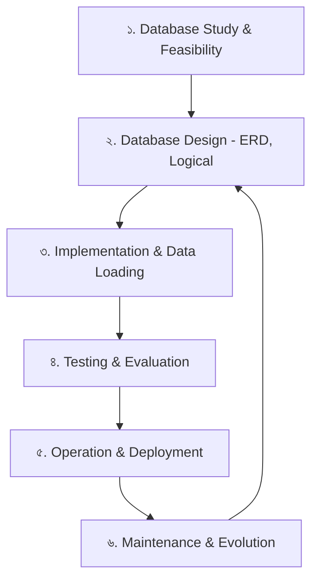
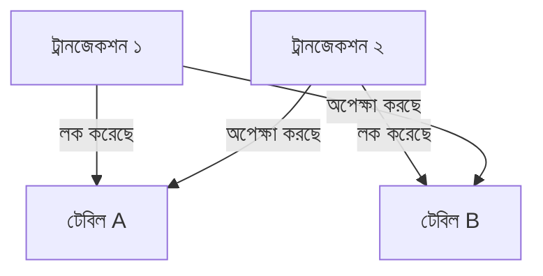
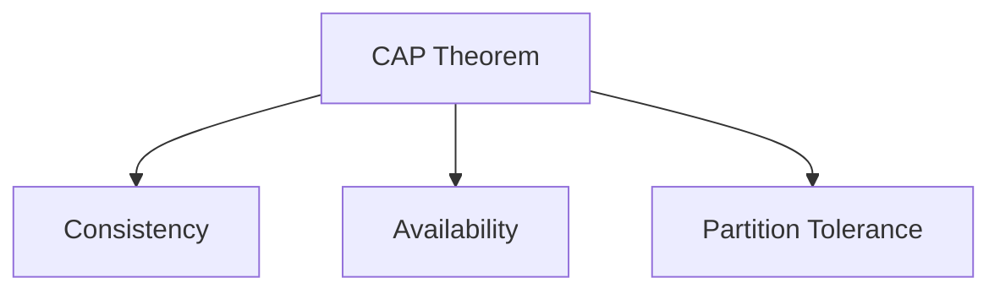

# Tech Concepts Q&A 3 (স্টাডি নোটস - পার্ট ৩)

এখানে আপনার আলোচনার বিশেষ অ্যাডভান্সড টপিকগুলো—যা একজন **Mid-Level Backend Engineer**-এর ডেটাবেস লাইফসাইকেল (DBLC) ক্যারিয়ারের জন্য জানা আবশ্যক—সেগুলো প্রশ্ন-উত্তর আকারে যোগ করা হলো।

---

### ডেটাবেস লাইফসাইকেল (Database Life Cycle - DBLC) কী?
ডেটাবেস তৈরির পরিকল্পনা থেকে শুরু করে ডিজাইন, টেস্টিং, প্রোডাকশনে চালানো এবং সময়ের সাথে সাথে তা মেইনটেইন ও আপডেট করার সম্পূর্ণ চক্রকেই **DBLC** বলা হয়। এর প্রধান ধাপগুলো হলো:



---

### প্রশ্ন ১: Database Migration (ডেটাবেস মাইগ্রেশন) কী? প্রোডাকশনে ডেটা না হারিয়ে কীভাবে স্কিমা চেঞ্জ (Schema Changes) হ্যান্ডেল করতে হয়?

**উত্তর:**
সফটওয়্যার ডেভেলপ করার সময় কোডের সাথে সাথে ডেটাবেসের টেবিল স্ট্রাকচারও পরিবর্তিত হয় (যেমন: নতুন কলাম যোগ করা, ডেটাটাইপ পরিবর্তন)। সফটওয়্যারের নতুন ভার্সন রিলিজের সময় ডেটাবেসের এই পরিবর্তনগুলোকে ট্র্যাক করার এবং প্রোডাকশনে নিরাপদে অ্যাপ্লাই করার পদ্ধতিকে **Database Migration** বলে।

#### মাইগ্রেশন টুলস:
*   **EF Core Migrations:** C# কোডের ওপর ভিত্তি করে অটো-মাইগ্রেশন জেনারেট করে।
*   **Flyway / Liquibase / DbUp:** Raw SQL স্কিপ্ট দিয়ে মাইগ্রেশন ট্র্যাকিং করার জন্য ব্যবহৃত হয়।

#### প্রোডাকশনে নিরাপদে মাইগ্রেশন করার নিয়ম (Best Practices):
১. **Up/Down Scripts:** প্রতিটি মাইগ্রেশনে দুটি অংশ থাকতে হবে—`Up` (পরিবর্তন অ্যাপ্লাই করার জন্য) এবং `Down` (কোনো সমস্যা হলে রোলব্যাক করে আগের অবস্থায় ফেরত যাওয়ার জন্য)।
২. **Avoid Destructive Changes (ধ্বংসাত্মক পরিবর্তন এড়ানো):** 
    *   সরাসরি কলাম ডিলিট (`DROP COLUMN`) বা নাম পরিবর্তন করবেন না। 
    *   **Expand and Contract (Expand/Transition/Contract) প্যাটার্ন** ব্যবহার করুন। যেমন: কলামের নাম বদলাতে হলে প্রথমে নতুন কলাম যোগ করুন (Expand), কোড আপডেট করে ডেটা কপি করুন (Transition), এবং সবশেষে পুরোনো কলাম ডিলিট করুন (Contract)।
৩. **Dry Run / Shadow Deployment:** প্রোডাকশনে রান করার আগে হুবহু প্রোডাকশনের মতো কপি ডেটা নিয়ে তৈরি স্টেজিং ডেটাবেসে মাইগ্রেশনটি রান করে এরর ও সময় চেক করুন।

---

### প্রশ্ন ২: Transaction Isolation Levels কী? Concurrency-র কারণে কী কী সমস্যা (Read Phenomena) হতে পারে?

**উত্তর:**
একই সময়ে ডেটাবেসে হাজার হাজার ইউজার ডেটা রিড ও রাইট করে। এক ইউজারের ট্রানজেকশন যেন অন্য ইউজারের ট্রানজেকশনের ওপর অপ্রত্যাশিত প্রভাব না ফেলে, তা নিয়ন্ত্রণ করার সেটিংসই হলো **Transaction Isolation Levels**।

#### Concurrency-র কারণে সৃষ্ট ৩টি মূল সমস্যা (Read Phenomena):
১. **Dirty Read:** ট্রানজেকশন A একটি ডেটা আপডেট করল কিন্তু এখনো Commit করেনি। ট্রানজেকশন B এসে ওই আন-কমিটেড ডেটা রিড করে নিয়ে গেল। পরে ট্রানজেকশন A কাজটি Rollback করে দিল। ফলে ট্রানজেকশন B-র রিড করা ডেটাটি ভুল বা "নোংরা" (Dirty) হয়ে গেল।
২. **Non-repeatable Read:** ট্রানজেকশন A একটি রো রিড করল। ট্রানজেকশন B এসে ওই রো-টি আপডেট করে Commit করে দিল। ট্রানজেকশন A আবার রিড করতে গিয়ে দেখল আগের ডেটাটি বদলে গেছে।
৩. **Phantom Read:** ট্রানজেকশন A একটি রেঞ্জের ডেটা রিড করল (যেমন: বয়স ২০ থেকে ৩০-এর মধ্যে সব স্টুডেন্ট)। ট্রানজেকশন B এসে এই রেঞ্জের মাঝে নতুন একটি স্টুডেন্ট Insert করে দিল। ট্রানজেকশন A পুনরায় কোয়েরি চালিয়ে দেখল একটি নতুন "ভুতুড়ে" (Phantom) রো যোগ হয়েছে।

#### ৪টি Isolation Levels (কম সুরক্ষিত থেকে বেশি সুরক্ষিত):

| Isolation Level | Dirty Read | Non-Repeatable Read | Phantom Read | পারফরম্যান্স |
| :--- | :--- | :--- | :--- | :--- |
| **Read Uncommitted** | হতে পারে | হতে পারে | হতে পারে | সবচেয়ে ফাস্ট |
| **Read Committed (Default)** | হবে না | হতে পারে | হতে পারে | ফাস্ট |
| **Repeatable Read** | হবে না | হবে না | হতে পারে | মিডিয়াম |
| **Serializable** | হবে না | হবে না | হবে না | সবচেয়ে স্লো (লক বেশি হয়) |

---

### প্রশ্ন ৩: Optimistic Concurrency এবং Pessimistic Concurrency-এর মধ্যে পার্থক্য কী? .NET-এ কীভাবে হ্যান্ডেল করা হয়?

**উত্তর:**
একই ডেটা যখন একাধিক ইউজার একসাথে মডিফাই করার চেষ্টা করে, তখন ডেটার গরমিল রোধ করতে এই দুই ধরনের লকিং কৌশল ব্যবহার করা হয়।

#### ১. Optimistic Concurrency Control (OCC):
*   **ধারণা:** "ধরে নেওয়া হয় কোনো সমস্যা হবে না।" এখানে ডেটা রিড করার সময় কোনো লক করা হয় না। কিন্তু সেভ করার সময় চেক করা হয় অন্য কেউ এসে ডেটা বদলে দিয়েছে কিনা।
*   **কীভাবে কাজ করে:** সাধারণত টেবিলে একটি `RowVersion` বা `Timestamp` কলাম রাখা হয়। আপডেট করার সময় যদি দেখা যায় ডাটাবেসের `RowVersion` পরিবর্তন হয়ে গেছে, তবে আপডেট ক্যানসেল হয়।
*   **.NET-এ ব্যবহার:** EF Core-এ কলামের ওপর `[ConcurrencyCheck]` বা `[Timestamp]` অ্যাট্রিবিউট ব্যবহার করা হয়। কনকারেন্সি ভায়োলেশন হলে এটি `DbUpdateConcurrencyException` থ্রো করে।

#### ২. Pessimistic Concurrency Control (PCC):
*   **ধারণা:** "ধরে নেওয়া হয় সমস্যা হবেই।" তাই ডেটা রিড করার সময়ই ওই রো-এর ওপর মেমরিতে তালা বা লক (Lock) মেরে দেওয়া হয়, যাতে অন্য কেউ ওই রো রিড বা আপডেট করতে না পারে।
*   **কীভাবে কাজ করে:** SQL-এ `SELECT ... WITH (XLOCK)` বা `FOR UPDATE` কুয়েরি চালিয়ে ডেটা লক করে রাখা হয়।
*   **কখন ব্যবহার করা হয়:** যেখানে ডেটা কনফ্লিক্ট হওয়ার সম্ভাবনা অনেক বেশি এবং ফিন্যান্সিয়াল ট্রানজেকশনে (যেমন: ট্রেনের টিকিট বুকিং বা ব্যাংকিং)।

---

### প্রশ্ন ৪: Database Scaling কী? Vertical Scaling এবং Horizontal Scaling-এর মধ্যে পার্থক্য কী? Read/Write Splitting কী?

**উত্তর:**
যখন অ্যাপ্লিকেশনে ট্রাফিক এবং ডেটার পরিমাণ বৃদ্ধি পায়, তখন ডেটাবেসের কর্মক্ষমতা বাড়ানোর প্রক্রিয়াকে **Database Scaling** বলে। এটি দুই উপায়ে করা যায়:

১. **Vertical Scaling (Scaling Up):**
    *   **ধারণা:** বিদ্যমান ডাটাবেস সার্ভারে র‍্যাম (RAM), প্রসেসর (CPU), এবং এসএসডি (SSD) স্টোরেজ বাড়িয়ে সার্ভারের পাওয়ার বৃদ্ধি করা।
    *   **সীাবদ্ধতা:** এর একটি ফিজিক্যাল লিমিট বা হার্ডওয়্যার লিমিট আছে। খরচ অনেক বেশি হয়।

২. **Horizontal Scaling (Scaling Out):**
    *   **ধারণা:** একটি বড় সার্ভারের বদলে একাধিক মাঝারি আকারের সার্ভার বা ডেটাবেস নোড যোগ করে ডেটা এবং রিকোয়েস্ট ভাগ করে নেওয়া (যেমন: Sharding ও Replication)।
    *   **সুবিধা:** প্রায় অসীম স্কেলিং সম্ভব। ক্লাউড সিস্টেমে এটি সহজে করা যায়।

#### Read/Write Splitting (রিড/রাইট স্প্লিটিং) কী?
এটি ডেটাবেস রেপ্লিকেশন (Replication)-এর একটি জনপ্রিয় আর্কিটেকচার। 
*   **Primary (Write) Node:** একটি সেন্ট্রাল ডেটাবেস সার্ভার থাকে যেখানে অ্যাপ্লিকেশন শুধুমাত্র `INSERT`, `UPDATE`, `DELETE` (Write) অপারেশনগুলো চালায়।
*   **Replica (Read) Nodes:** প্রাইমারি নোডের ডেটা অটোমেটিক্যালি একাধিক কপি সার্ভারে (Replicas) সিঙ্ক হয়ে যায়। অ্যাপ্লিকেশন সব `SELECT` (Read) কোয়েরিগুলো এই রেপ্লিকা নোডগুলো থেকে চালায়। 
*   **সুবিধা:** রিড কোয়েরির জন্য মূল রাইট সার্ভারের ওপর লোড পড়ে না, ফলে অ্যাপ্লিকেশন অনেক ফাস্ট লোড হয়।

---

### প্রশ্ন ৫: Database Backup এবং Disaster Recovery (DR)-এর প্রধান প্রকারভেদগুলো কী কী? Point-in-Time Recovery (PITR) কী?

**উত্তর:**
হার্ডওয়্যার ফেইলর, হ্যাকিং বা মানবিক ভুলের কারণে ডেটাবেস ডিলিট হয়ে গেলে তা পুনরুদ্ধারের জন্য ব্যাকআপ অত্যন্ত জরুরি।

#### ব্যাকআপের প্রধান ৩টি প্রকারভেদ:
১. **Full Backup:** ডেটাবেসে থাকা সব ফাইল, টেবিল, এবং ডেটার একটি সম্পূর্ণ ব্যাকআপ। এটি তৈরি করতে সবচেয়ে বেশি সময় এবং জায়গা লাগে।
২. **Differential Backup:** শেষ ফুল ব্যাকআপের পর থেকে এ পর্যন্ত যে যে ডেটা পরিবর্তিত হয়েছে, শুধুমাত্র সেগুলোর ব্যাকআপ রাখা। এটি ফুল ব্যাকআপের চেয়ে দ্রুত হয়।
৩. **Transaction Log Backup (T-Log):** ডেটাবেসে ঘটা প্রতিটি ট্রানজেকশনের লগ ব্যাকআপ রাখা। এটি প্রতি ৫ বা ১৫ মিনিট পর পর নেওয়া হয়। 

#### Point-in-Time Recovery (PITR) কী?
যদি কেউ ভুলবশত দুপুর ১২:০৫ মিনিটে একটি টেবিল ড্রপ করে দেয়, তবে PITR-এর মাধ্যমে ডেটাবেসকে দুপুর ১২:০৪ মিনিট ৫৯ সেকেন্ডের অবস্থায় (সুনির্দিষ্ট সেকেন্ডে) ফিরিয়ে নিয়ে যাওয়া সম্ভব। 
*   **কীভাবে কাজ করে:** ফুল ব্যাকআপ, ডিফারেনশিয়াল ব্যাকআপ এবং ট্রানজেকশন লগ ব্যাকআপগুলোকে ক্রমানুসারে প্লে (Play) করে ডেটাবেসকে ধ্বংস হওয়ার ঠিক আগের সেকেন্ডে ফিরিয়ে নেওয়া হয়।

---

### প্রশ্ন ৬: Database Connection Pool Management কী? এটি হ্যান্ডেল না করলে কী কী সমস্যা হতে পারে?

**উত্তর:**
ডেটাবেসের সাথে কানেকশন তৈরি করা একটি ব্যয়বহুল (Resource Heavy) কাজ। প্রতিবার কোয়েরি চালানোর জন্য নতুন কানেকশন খুলে আবার বন্ধ করলে নেটওয়ার্ক ও মেমরি লোড অনেক বেড়ে যায়। 

**Connection Pooling** হলো আগে থেকে তৈরি করা কিছু সচল কানেকশনের একটি গ্রুপ বা পুল (Pool)। যখনই কোনো কোয়েরি চালানোর প্রয়োজন হয়, অ্যাপ্লিকেশন পুল থেকে একটি ফ্রি কানেকশন ধার নেয় এবং কাজ শেষে তা পুলে ফেরত দেয় (কানেকশন বন্ধ করে না)।

#### ভুল ম্যানেজমেন্টের কারণে সৃষ্ট সমস্যাসমূহ:
১. **Connection Leaks (কানেকশন লিক):** কোডে ডেটাবেস কানেকশন ওপেন করার পর যদি তা সঠিকভাবে ক্লোজ বা ডিসপোজ (`using` ব্লক বা `Dispose()`) করা না হয়, তবে কানেকশনগুলো চিরতরে আটকে থাকে।
২. **Pool Starvation (পুল অনাহার):** পুলে থাকা সব কানেকশন লিক বা অন্য কাজে ব্যস্ত হয়ে পড়লে নতুন রিকোয়েস্ট কোনো কানেকশন পায় না। ফলে অ্যাপ্লিকেশন হ্যাং হয়ে যায় এবং `Timeout Exception` দেখায়।

---

### প্রশ্ন ৭: Database Locks (লক) এবং Deadlock (ডেডলক) বলতে কী বোঝায়? কীভাবে ডেডলক এড়ানো যায়?

**উত্তর:**
ডেটাবেসে ডেটার অখণ্ডতা রক্ষা করার জন্য যখন কোনো ট্রানজেকশন ডেটা মডিফাই করে, তখন ডেটাবেস ইঞ্জিন ওই ডেটার ওপর সাময়িক তালা বা **Lock** বসায়, যাতে অন্য কেউ একই সময়ে তা এডিট করে ডেটা নষ্ট করতে না পারে।

#### লক-এর প্রধান প্রকারভেদ:
১. **Shared Lock (S):** ডেটা রিড করার সময় এটি ব্যবহার করা হয়। একই ডেটা একসাথে অনেকে রিড করতে পারে (একাধিক Shared Lock একসাথে থাকতে পারে)।
২. **Exclusive Lock (X):** ডেটা রাইট (Insert/Update/Delete) করার সময় এটি ব্যবহার করা হয়। অন্য কোনো লককে এটি অ্যাক্সেস করতে দেয় না (কেবল একটি ট্রানজেকশনই Exclusive Lock পেতে পারে)।

#### Deadlock (ডেডলক) কী?
ডেডলক হলো এমন একটি পরিস্থিতি যখন দুটি আলাদা ট্রানজেকশন একে অপরের লক করা ডেটা পাওয়ার জন্য অপেক্ষা করতে করতে এমন অবস্থায় চলে যায় যে কেউই আর এগোতে পারে না (মেমরি জট)।


*   *উদাহরণ:* ট্রানজেকশন ১ টেবিল A লক করেছে এবং টেবিল B আপডেট করতে চায়। একই সময়ে ট্রানজেকশন ২ টেবিল B লক করেছে এবং টেবিল A আপডেট করতে চায়। এখন ট্রানজেকশন ১ অপেক্ষা করছে টেবিল B-এর লকের জন্য, আর ট্রানজেকশন ২ অপেক্ষা করছে টেবিল A-এর লকের জন্য। একেই বলে ডেডলক। ডেটাবেস ইঞ্জিন স্বয়ংক্রিয়ভাবে একটি ট্রানজেকশনকে ভিকটিম (Victim) বানিয়ে বাতিল করে এবং অন্যটি রান করায়।

#### ডেডলক এড়ানোর উপায় (Best Practices):
১. **একই অর্ডারে অ্যাক্সেস:** সব ট্রানজেকশনে টেবিলগুলোকে সবসময় একই অর্ডারে (যেমন: প্রথমে টেবিল A, তারপর টেবিল B) আপডেট করুন।
২. **ছোট ট্রানজেকশন:** ট্রানজেকশনের সাইজ ছোট রাখুন এবং দ্রুত Commit করুন, যাতে লক দীর্ঘস্থায়ী না হয়।
৩. **কম আইসোলেশন লেভেল:** প্রয়োজন ছাড়া উচ্চতর আইসোলেশন লেভেল (যেমন: Serializable) ব্যবহার করবেন না।

---

### প্রশ্ন ৮: Execution Plan-এ Table Scan, Index Scan এবং Index Seek-এর মধ্যে পার্থক্য কী? কোনটি সবচেয়ে ফাস্ট?

**উত্তর:**
SQL Server-এ কোনো কোয়েরি চালানোর সময় ডেটাবেস ব্যাকগ্রাউন্ডে কীভাবে ডেটা খুঁজবে তার যে রোডম্যাপ বা লজিক্যাল ম্যাপ তৈরি করে, তাকে **Execution Plan** বলে।

ডেটা খোঁজার ৩টি প্রধান মেকানিজম হলো:

১. **Table Scan (অথবা Clustered Index Scan):**
    *   **ব্যাখ্যা:** যখন ডেটাবেস কাঙ্ক্ষিত ডেটা খুঁজে পেতে পুরো টেবিলের প্রতিটি রেকর্ড একে একে শুরু থেকে শেষ পর্যন্ত চেক করে।
    *   *পারফরম্যান্স:* সবচেয়ে স্লো (যদি টেবিলে ইনডেক্স না থাকে বা বিশাল পরিমাণ ডেটা থাকে)।

২. **Index Scan (নন-ক্লাস্টার্ড ইনডেক্স স্ক্যান):**
    *   **ব্যাখ্যা:** পুরো ফিজিক্যাল টেবিল স্ক্যান না করে, ইনডেক্স করা কলামের পুরো ইনডেক্স ট্রি-টি ওপর থেকে নিচ পর্যন্ত স্ক্যান করে ডেটা খোঁজা।
    *   *পারফরম্যান্স:* টেবিল স্ক্যানের চেয়ে ফাস্ট, তবে এটিও পুরো ইনডেক্স স্ক্যান করে।

৩. **Index Seek (ইনডেক্স সিক):**
    *   **ব্যাখ্যা:** ডেটাবেস সরাসরি ইনডেক্স ব্যবহার করে কাঙ্ক্ষিত ডেটার নির্দিষ্ট ঠিকানায় চলে যায়। এটি পুরো ইনডেক্স স্ক্যান করে না।
    *   *পারফরম্যান্স:* **সবচেয়ে ফাস্ট ও কার্যকরী (Highly Optimized)**।

*সারসংক্ষেপ:* পারফরম্যান্স অপ্টিমাইজেশনের মূল লক্ষ্য হলো কুয়েরিগুলোকে **Table Scan** থেকে **Index Seek**-এ রূপান্তর করা।

---

### প্রশ্ন ৯: Database Caching (ডেটাবেস ক্যাশিং) কী? Cache-Aside প্যাটার্ন কীভাবে কাজ করে?

**উত্তর:**
বারবার ডেটাবেসে কোয়েরি চালিয়ে সিপিইউ ও মেমরি খরচ না করে, ঘন ঘন ব্যবহৃত ডেটা খুব দ্রুত পড়া যায় এমন মেমরিতে (যেমন: Redis, Memcached, বা In-Memory) সাময়িকভাবে সেভ করে রাখার প্রক্রিয়াকে **Database Caching** বলে।

#### Cache-Aside (Lazy Loading) প্যাটার্ন:
এটি ব্যাকএন্ড ডেভেলপমেন্টে ক্যাশিংয়ের সবচেয়ে জনপ্রিয় প্যাটার্ন। এটি যেভাবে কাজ করে:

```mermaid
sequenceDiagram
    Application->>Cache: ১. ডেটা আছে কি? (Cache Hit/Miss)
    alt Cache Hit (ডেটা আছে)
        Cache-->>Application: ২. ডেটা রিটার্ন করো
    alt Cache Miss (ডেটা নেই)
        Application->>Database: ৩. ডেটাবেস থেকে রিড করো
        Database-->>Application: ৪. ডেটা রিটার্ন করো
        Application->>Cache: ৫. নতুন ডেটা ক্যাশে সেভ করো (পরের বারের জন্য)
    end
```

১. অ্যাপ্লিকেশন কোনো ডেটা চাইলে প্রথমে ক্যাশে চেক করে।
২. **Cache Hit:** ডেটা ক্যাশে থাকলে তা সরাসরি নিয়ে নেয় (ডেটাবেসে কল যায় না)।
৩. **Cache Miss:** ডেটা ক্যাশে না থাকলে ডেটাবেস থেকে রিড করে এনে ক্যাশে রাইট করে দেয়, যাতে পরের বার দ্রুত পাওয়া যায়।

---

### প্রশ্ন ১০: CAP Theorem কী? SQL বনাম NoSQL ডেটাবেস কখন কোনটি ব্যবহার করবেন?

**উত্তর:**
ডিস্ট্রিবিউটেড সিস্টেম (Distributed Systems) ডিজাইনের একটি কোর থিওরি হলো **CAP Theorem**। এটি বলে যে, একটি ডিস্ট্রিবিউটেড সিস্টেমে একই সাথে নিচের ৩টি বৈশিষ্ট্যের মধ্যে কেবল **২টি** অর্জন করা সম্ভব, ৩টি একসাথে করা অসম্ভব:

১. **Consistency (C - সংগতি):** সব নোড বা সার্ভারে একই সময়ে হুবহু একই ডেটা থাকবে।
২. **Availability (A - প্রাপ্যতা):** প্রতিটি রিকোয়েস্ট সফল বা ব্যর্থ যাই হোক, একটি রেসপন্স নিশ্চিতভাবে পাবে (সিস্টেম ডাউন থাকবে না)।
৩. **Partition Tolerance (P - বিভাজন সহনশীলতা):** নেটওয়ার্কের নোডগুলোর মাঝে যোগাযোগ বিচ্ছিন্ন হয়ে গেলেও সিস্টেম সচল থাকবে।



#### SQL (Relational) বনাম NoSQL (Non-Relational) কখন কোনটি ব্যবহার করবেন?

*   **SQL Database (যেমন: SQL Server, PostgreSQL):**
    *   **বৈশিষ্ট্য:** ACID ট্রানজেকশন মেনে চলে, রিলেশনাল ডেটা ও স্ট্রাকচারড স্কিমা।
    *   **কখন ব্যবহার করবেন:** ফিন্যান্সিয়াল বা ব্যাংকিং সিস্টেমে, যেখানে প্রতি পয়সার হিসাব নিখুঁত হওয়া জরুরি (ACID) এবং ডেটার মধ্যে জটিল সম্পর্ক (Relations) থাকে।

*   **NoSQL Database (যেমন: MongoDB, Redis, Cassandra):**
    *   **বৈশিষ্ট্য:** কোনো ফিক্সড স্কিমা নেই, খুব দ্রুত ডেটা রিট্রিভ করা যায় এবং সহজে হরিজন্টাল স্কেলিং করা যায়।
    *   **কখন ব্যবহার করবেন:** আন-স্ট্রাকচারড ডেটা (যেমন: চ্যাট মেসেজ, সোশ্যাল মিডিয়া ফিড, প্রোডাক্ট ক্যাটালগ) এবং যেখানে সেকেন্ডে লাখ লাখ রিড/রাইট হ্যান্ডেল করতে হয় ও হাই-অ্যাভেইল্যাবিলিটি বেশি গুরুত্বপূর্ণ।

