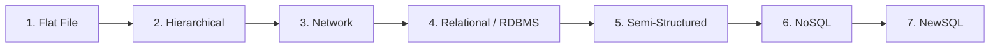

# Tech Concepts Q&A 5: Database Viva Preparation & Lifecycle Deep Dive

> এই ডকুমেন্টে আজকের সম্পূর্ণ আলোচনা (A to Z) ভাইভায় সর্বোচ্চ আত্মবিশ্বাসের সাথে উত্তর দেওয়ার উপযোগী করে বিস্তারিত টেকনিক্যাল ব্যাখ্যা, বাস্তব উদাহরণ এবং প্রোডাকশন-লেভেল কোড সিনট্যাক্সসহ সাজানো হয়েছে।

---

## সূচিপত্র
1. [পর্ব ১: Database, DBMS এবং RDBMS-এর মৌলিক ভিত্তি](#পর্ব-১-database-dbms-এবং-rdbms-এর-মৌলিক-ভিত্তি)
2. [পর্ব ২: ACID Properties — ইঞ্জিন লেভেল মেকানিজম](#পর্ব-২-acid-properties--ইঞ্জিন-লেভেল-মেকানিজম)
3. [পর্ব ৩: Data Model-এর ঐতিহাসিক বিবর্তন (Evolution)](#পর্ব-৩-data-model-এর-ঐতিহাসিক-বিবর্তন-evolution)
4. [পর্ব ৪: TCL (Transaction Control Language) — সম্পূর্ণ নির্দেশিকা](#পর্ব-৪-tcl-transaction-control-language--সম্পূর্ণ-নির্দেশিকা)
5. [পর্ব ৫: CAP Theorem — ডিস্ট্রিবিউটেড সিস্টেমের মূলনীতি](#পর্ব-৫-cap-theorem--ডিস্ট্রিবিউটেড-সিস্টেমের-মূলনীতি)
6. [পর্ব ৬: ER Diagram — উপাদান, সিম্বল এবং কার্ডিনালিটি](#পর্ব-৬-er-diagram--উপাদান-সিম্বল-এবং-কার্ডিনালিটি)
7. [পর্ব ৭: Data Integrity (ডেটার শুদ্ধতা) নিশ্চিত করার ৪টি স্তম্ভ](#পর্ব-৭-data-integrity-ডেটার-শুদ্ধতা-নিশ্চিত-করার-৪টি-স্তম্ভ)
8. [পর্ব ৮: Normalization (1NF, 2NF, 3NF) এবং ডেটা অ্যানোমালি](#পর্ব-৮-normalization-1nf-2nf-3nf-এবং-ডেটা-অ্যানোমালি)
9. [পর্ব ৯: Partitioning বনাম Sharding (লজিক্যাল বনাম ফিজিক্যাল)](#পর্ব-৯-partitioning-বনাম-sharding-লজিক্যাল-বনাম-ফিজিক্যাল)
10. [পর্ব ১০: DDL, Constraints, Cascading এবং DDL Triggers](#পর্ব-১০-ddl-constraints-cascading-এবং-ddl-triggers)
11. [পর্ব ১১: DML, DQL, Joins, Subqueries, Temp Tables এবং Functions](#পর্ব-১১-dml-dql-joins-subqueries-temp-tables-এবং-functions)

---

# পর্ব ১: Database, DBMS এবং RDBMS-এর মৌলিক ভিত্তি

### প্রশ্ন ১: Database, DBMS এবং RDBMS কী এবং এদের মূল পার্থক্য কী?

#### ১. Database (ডেটাবেস):
* **সংজ্ঞা:** সুশৃঙ্খল, সুসংগঠিত এবং কাঠামোগতভাবে সংরক্ষিত তথ্যের (Structured Data) একটি ডিজিটাল সংগ্রহশালা, যেখান থেকে প্রয়োজনমতো সহজে ডেটা অ্যাক্সেস, সার্চ, ম্যানেজ ও আপডেট করা যায়।
* **সহজ উদাহরণ:** একটি লাইব্রেরির বই, মেম্বার ও লেনদেনের যাবতীয় ডিজিটাল রেকর্ড।

#### ২. DBMS (Database Management System):
* **সংজ্ঞা:** এটি একটি সিস্টেম সফটওয়্যার যা ডেটাবেস তৈরি, পরিচালনা এবং নিয়ন্ত্রণ করার ইন্টারফেস দেয়। এটি মূলত ওএস ফাইল সিস্টেমের ওপর একটি স্তর যা ফাইল-ভিত্তিক ডেটা স্টোরেজ সুবিধা দেয়।
* **বৈশিষ্ট্য:** টেবিলগুলোর মধ্যে কোনো স্বয়ংক্রিয় রিলেশনশিপ থাকে না, ডেটা সাধারণত হায়ারার্কিকাল বা নেভিগেশনাল ফাইলে সংরক্ষিত হয়।
* **উদাহরণ:** XML/File-based storage, MS Access, dBase, FoxPro।

#### ৩. RDBMS (Relational Database Management System):
* **সংজ্ঞা:** DBMS-এর আধুনিক রূপ, যেখানে ডেটা সম্পর্কিত টেবিল (Row ও Column) আকারে থাকে এবং বিভিন্ন টেবিলের মধ্যে **Primary Key** ও **Foreign Key** দিয়ে লজিক্যাল রিলেশন বজায় রাখা হয়।
* **বৈশিষ্ট্য:** এটি কঠোরভাবে **ACID Properties** মেনে চলে এবং ডেটা ম্যানিপুলেশনের জন্য **SQL** ব্যবহার করে।
* **উদাহরণ:** Microsoft SQL Server, PostgreSQL, MySQL, Oracle।

#### এক নজরে ভাইভা তুলনা:

| বৈশিষ্ট্য | DBMS | RDBMS |
| :--- | :--- | :--- |
| **ডেটা মডেল** | ফাইল, ট্রি বা গ্রাফ আকারে | টেবিল (Relations: Rows & Columns) |
| **সম্পর্ক (Relationships)** | টেবিলের মধ্যে কোনো সরাসরি রিলেশন নেই | Keys (PK/FK) দিয়ে টেবিলগুলো সম্পর্কিত |
| **ACID সাপোর্ট** | পুরোপুরি সাপোর্ট নাও করতে পারে | শতভাগ কঠোরভাবে ACID মেনে চলে |
| **স্কেলিবিলিটি ও নিরাপত্তা** | ছোট ও একক ইউজারের জন্য উপযোগী | বিশাল এন্টারপ্রাইজ ও বহু-ইউজারের জন্য উপযুক্ত |

---

# পর্ব ২: ACID Properties — ইঞ্জিন লেভেল মেকানিজম

> **ACID হলো চারটি নিয়মের সমষ্টি, যা ডাটাবেস ট্রানজেকশনের নির্ভরযোগ্যতা এবং নির্ভুলতা নিশ্চিত করে।**

### ১. Atomicity (অবিভাজ্যতা — "All or Nothing")
* **তাত্ত্বিক সংজ্ঞা:** ট্রানজেকশন কাজের একটি অবিভাজ্য একক। এর সব কয়টি স্টেটমেন্ট সফল হবে, নয়তো একটিও কার্যকর হবে না।
* **বাস্তব উদাহরণ:** A অ্যাকাউন্ট থেকে ৫০০ টাকা কাটলো কিন্তু B অ্যাকাউন্টে ক্রেডিট হওয়ার আগেই সিস্টেম অফ হয়ে গেল। Atomicity নিশ্চিত করে টাকা ঝুলবে না, A-এর ব্যালেন্স আগের অবস্থায় ফিরে যাবে (Rollback)।
* **⚙️ ইঞ্জিন লেভেল:** ইঞ্জিন মেমোরির **Undo Log** ব্যবহার করে। কোনো স্টেটমেন্ট ফেইল করলে ইঞ্জিন আনডু লগ পড়ে ডাটাকে তার পূর্বের অবস্থায় ওভাররাইট করে।

### ২. Consistency (সঙ্গতি / নিয়ম রক্ষা)
* **তাত্ত্বিক সংজ্ঞা:** ট্রানজেকশনের আগে ও পরে ডেটাবেসকে অবশ্যই পূর্বনির্ধারিত স্কিমা রুলস, কনস্ট্রেইন্ট ও ইনভ্যারিয়েন্ট অনুযায়ী বৈধ অবস্থায় (Valid State) থাকতে হবে।
* **বাস্তব উদাহরণ:** ব্যাংক অ্যাকাউন্টের ব্যালেন্স কোনো অবস্থাতেই নেগেটিভ হতে পারবে না (`CHECK (Balance >= 0)`)। কোনো ট্রানজেকশন ব্যালেন্সকে -১০০ করতে পারবে না।
* **⚙️ ইঞ্জিন লেভেল:** ডেটাবেস ইঞ্জিন প্রতি ধাপে `NOT NULL`, `PRIMARY KEY`, `FOREIGN KEY`, `CHECK` ইত্যাদি কনস্ট্রেইন্ট মূল্যায়ন করে। কোনো নিয়ম ভাঙলেই এক্সেপশন ছুড়ে ট্রানজেকশন বাতিল করে।

### ৩. Isolation (পৃথকীকরণ / কনকারেন্সি কন্ট্রোল)
* **তাত্ত্বিক সংজ্ঞা:** একই সময়ে একাধিক ট্রানজেকশন চললেও তাদের একটি অন্যটির অসম্পূর্ণ ফলাফল দেখতে পাবে না। প্রতিটি ট্রানজেকশন মনে করবে সে সিস্টেমে একাই চলছে।
* **বাস্তব উদাহরণ:** ট্রেনের শেষ ১টি আসন দুজনের কাছে একসাথে বুকিং হতে পারবে না।
* **⚙️ ইঞ্জিন লেভেল:**
  1. **Pessimistic (Locking):** রিডের জন্য Shared Lock (S-Lock) এবং রাইটের জন্য Exclusive Lock (X-Lock)।
  2. **Optimistic (MVCC - Multi-Version Concurrency Control):** PostgreSQL ও SQL Server-এ রাইটাররা রিডারদের আটকায় না; রিডাররা ডেটার পুরোনো স্ন্যাপশট ভার্সন পড়ে।
  * **৪টি Isolation Level:**
    - `Read Uncommitted` (সবচেয়ে দ্রুত, কিন্তু Dirty Read ঘটে)
    - `Read Committed` (ডিফল্ট, কেবল কমিটেড ডেটা পড়ে)
    - `Repeatable Read` (ট্রানজেকশন চলাকালীন একই ডেটা বারবার পড়লে একই মান থাকে)
    - `Serializable` (সবচেয়ে নিরাপদ, সম্পূর্ণ সিরিয়ালভাবে চলে)

### ৪. Durability (স্থায়িত্ব)
* **তাত্ত্বিক সংজ্ঞা:** ট্রানজেকশন একবার `COMMIT` হয়ে গেলে সিস্টেম ক্র্যাশ বা পাওয়ার অফ হলেও সেই ডেটা চিরদিনের জন্য সংরক্ষিত থাকবে।
* **বাস্তব উদাহরণ:** পেমেন্ট কনফার্মেশন পাওয়ার পর সার্ভারে আগুন লেগে গেলেও আপনার পেমেন্ট রেকর্ড অক্ষত থাকবে।
* **⚙️ ইঞ্জিন লেভেল:** **WAL (Write-Ahead Logging)** টেকনিক। টেবিলে আসল ডেটা লেখার আগেই সিকোয়েনশিয়াল ট্রানজেকশন লগ ফাইলে `COMMIT` রেকর্ড ডিস্কে বাধ্যতামূলকভাবে ফ্ল্যাশ (`fsync`) করা হয়। সিস্টেম রিস্টার্ট হলে ইঞ্জিন লগ ফাইল পড়ে ক্র্যাশের আগের কাজগুলোকে **Redo (Roll-Forward)** করে দেয়।

---

# পর্ব ৩: Data Model-এর ঐতিহাসিক বিবর্তন (Evolution)



1. **Flat-File Model (১৯৬০ এর দশক):** সাধারণ কমা-সেপারেটেড (CSV) বা টেক্সট ফাইল। কোনো রিলেশন বা কনস্ট্রেইন্ট ছিল না, প্রচুর ডুপ্লিকেশন হতো।
2. **Hierarchical Model:** ট্রি স্ট্রাকচার (1:N)। প্যারেন্ট-চাইল্ড সম্পর্ক (যেমন: IBM IMS)। সীমাবদ্ধতা: Many-to-Many হ্যান্ডেল করা যেত না।
3. **Network Model:** গ্রাফ স্ট্রাকচার। একটি চাইল্ডের একাধিক প্যারেন্ট থাকতে পারে (CODASYL)। সীমাবদ্ধতা: জটিল পয়েন্টার ভিত্তিক হওয়ায় কুয়েরি করা অত্যন্ত দুরূহ ছিল।
4. **Relational Model / RDBMS (১৯৭০ - বর্তমান):** ড. এডগার এফ. কড (E.F. Codd) প্রস্তাবিত। টেবিল ও গাণিতিক সম্পর্কের ওপর প্রতিষ্ঠিত। ভাষা: SQL।
5. **Semi-Structured Data (২০০০ এর দশক):** XML ও JSON ভিত্তিক স্টোরেজ।
6. **NoSQL (বিগ ডেটা যুগ):** স্কিমাহীন ও হাইপার-স্কেলিংয়ের জন্য:
   - *Document:* MongoDB
   - *Key-Value:* Redis
   - *Column-Family:* Cassandra
   - *Graph:* Neo4j
7. **NewSQL / Distributed SQL (বর্তমান):** NoSQL-এর মতো হরাইজন্টাল স্কেলিং + RDBMS-এর ফুল ACID গ্যারান্টি (যেমন: Google Spanner, CockroachDB)।

---

# পর্ব ৪: TCL (Transaction Control Language) — সম্পূর্ণ নির্দেশিকা

### রহস্য: "END TRANSACTION" কেন নেই?
ডাটাবেসে ট্রানজেকশন কোনো নিউট্রাল কমান্ড দিয়ে শেষ হয় না। ট্রানজেকশন সফল হলে **`COMMIT`** দিয়ে শেষ করতে হয়, আর ব্যর্থ হলে **`ROLLBACK`** দিয়ে শেষ করতে হয়। অর্থাৎ, **`COMMIT` এবং `ROLLBACK`-ই হলো ট্রানজেকশন END করার একমাত্র উপায়।**

### TCL-এর ৬টি মূল কমান্ড:
1. **`BEGIN TRANSACTION` (বা `BEGIN TRAN`):** ট্রানজেকশন শুরু ঘোষণা করে এবং ট্রানজেকশন লগ ট্র্যাকিং অন করে।
2. **`COMMIT`:** সমস্ত পরিবর্তন ডেটাবেসে স্থায়ী করে, লক ছেড়ে দেয় এবং ট্রানজেকশন শেষ করে।
3. **`ROLLBACK`:** এরর ঘটলে ট্রানজেকশন শুরু হওয়ার আগের অবস্থায় ডেটাকে ফিরিয়ে নিয়ে ট্রানজেকশন সমাপ্ত করে।
4. **`SAVEPOINT` (বা `SAVE TRAN <Name>`):** বড় ট্রানজেকশনের মাঝে চেকপয়েন্ট বসায়, যাতে পুরোটা বাতিল না করে শুধু ওই সেভপয়েন্ট পর্যন্ত আংশিক রোলব্যাক করা যায়।
5. **`RELEASE SAVEPOINT <Name>`:** সেভপয়েন্ট মেমোরি থেকে মুক্ত করে রিসোর্স বাঁচায় (Postgres/MySQL/Oracle)।
6. **`SET TRANSACTION`:** ট্রানজেকশন শুরুর আগে তার আইসোলেশন লেভেল বা রিড-অনলি মোড নির্ধারণ করে।

### প্রোডাকশন ট্র্যাকিং টুলস (SQL Server):
* **`@@TRANCOUNT`:** বর্তমানে কয়টি ট্রানজেকশন ওপেন আছে তার সংখ্যা দেয়। `0` না হওয়া পর্যন্ত পরিবর্তন পার্মানেন্ট হয় না।
* **`XACT_STATE()`:** 
  - `1` = ট্রানজেকশন সুস্থ ও কমিটেবল।
  - `0` = কোনো ট্রানজেকশন চালু নেই।
  - `-1` = **Doomed Transaction!** অবশ্যই রোলব্যাক করতে হবে, কোনোভাবেই কমিট করা যাবে না।
* **`SET XACT_ABORT ON`:** কোনো স্টেটমেন্টে রানটাইম এরর হওয়ামাত্র স্বয়ংক্রিয়ভাবে পুরো ট্রানজেকশন রোলব্যাক করে দেয়।

---

# পর্ব ৫: CAP Theorem — ডিস্ট্রিবিউটেড সিস্টেমের মূলনীতি

২০০০ সালে এরিক ব্রুয়ার এটি প্রস্তাব করেন এবং ২০০২ সালে এটি গাণিতিকভাবে প্রমাণিত হওয়ায় একে **CAP Theorem** বলা হয়।

> *"একটি ডিস্ট্রিবিউটেড সিস্টেমে একসাথে Consistency, Availability এবং Partition Tolerance—এই তিনটির তিনটিই অর্জন করা অসম্ভব। সর্বোচ্চ যেকোনো দুটি বেছে নেওয়া যায়।"*

* **C - Consistency:** প্রতিটি নোড সবসময় এক সেকেন্ডের তফাত ছাড়া লেটেস্ট ডেটা দেখাবে।
* **A - Availability:** কোনো নোড ডাউন হলেও ক্লায়েন্ট সবসময় সফল (Non-error) রেসপন্স পাবে।
* **P - Partition Tolerance:** সার্ভারগুলোর নিজেদের মধ্যকার ক্যাবল কেটে গেলেও বা নেটওয়ার্ক বিচ্ছিন্ন হলেও সিস্টেম জীবিত থাকবে।

### বাস্তব প্রয়োগ (CP বনাম AP):
বাস্তব নেটওয়ার্কে সংযোগ সাময়িক বিচ্ছিন্ন হতেই পারে, তাই **P বাধ্যতামূলক**। ফলে সিস্টেম ডিজাইনারদের বেছে নিতে হয়:
* **CP সিস্টেম (Consistency + Partition Tolerance):** ভুল ডেটা দেওয়ার চেয়ে সিস্টেম এরর দেবে (যেমন: ব্যাংকিং, পেমেন্ট গেটওয়ে, **MongoDB**, **Redis**)।
* **AP সিস্টেম (Availability + Partition Tolerance):** পুরোনো ডেটা দিলেও সাইট সবসময় আপ থাকবে (যেমন: ইউটিউব/ফেসবুক লাইক কাউন্ট, **Cassandra**, **DynamoDB**)।
* **CA সিস্টেম:** নেটওয়ার্ক পার্টিশন হতে পারবে না—এটি লোকাল সিঙ্গেল-নোড RDBMS-এ সম্ভব।

---

# পর্ব ৬: ER Diagram — উপাদান, সিম্বল এবং কার্ডিনালিটি

১৯৭৬ সালে পিটার চেন (Peter Chen) এই ভিজ্যুয়াল মডেলিং পদ্ধতি উদ্ভাবন করেন।

```
    [ Entity ]          ( Attribute )         < Relationship >
   (আয়তক্ষেত্র)            (উপবৃত্ত)                (রম্বস)
```

### ১. Entities (সত্ত্বা):
* **Strong Entity:** নিজস্ব প্রাইমারি কি আছে (যেমন: `Student`) -> **Single Rectangle** `[ ]`।
* **Weak Entity:** নিজস্ব প্রাইমারি কি নেই, প্যারেন্টের ওপর নির্ভরশীল (যেমন: `Dependent`) -> **Double Rectangle** `[[ ]]`।

### ২. Attributes (বৈশিষ্ট্য):
* **Key Attribute:** প্রাইমারি কি -> **Underlined Text Inside Oval** (`<u>ID</u>`)।
* **Simple vs Composite:** Simple (অবিভাজ্য: `Age`), Composite (একাধিক তথ্যের যোগফল: `Address` বা `Name`)।
* **Multivalued Attribute:** যার একাধিক মান থাকতে পারে (যেমন: `PhoneNumber`) -> **Double Oval** `(( ))`।
* **Derived Attribute:** হিসাব করে বের করা মান (যেমন: জন্মতারিখ থেকে বের করা `Age`) -> **Dashed Oval**।

### ৩. Relationships & Cardinality:
* **সম্পর্ক:** ডায়মন্ড চিহ্ন `< >`। উইক রিলেশনশিপ হলে ডাবল ডায়মন্ড `<< >>`।
* **Degree:** Unary (নিজের সাথে), Binary (২টি এন্টিটির মাঝে), Ternary (৩টি এন্টিটির মাঝে)।
* **কার্ডিনালিটি:** One-to-One (1:1), One-to-Many (1:N), Many-to-Many (M:N — এটি সমাধান করতে জাংশন টেবিল লাগে)।
* **Participation:** Total (বাধ্যতামূলক — **Double Line**), Partial (ঐচ্ছিক — **Single Line**)।

---

# পর্ব ৭: Data Integrity (ডেটার শুদ্ধতা) নিশ্চিত করার ৪টি স্তম্ভ

> **টেবিল তৈরি মানে শুধু আলমারি বানানো; আর Data Integrity মানে তাতে যেন কোনো ভুলভাল বা অবৈধ জিনিস না ঢুকে তার জন্য কড়া গার্ডরেল বসানো।**

1. **Entity Integrity:** প্রতিটি রো ইউনিক হবে, কোনো ডুপ্লিকেট বা ভুতুড়ে রো থাকবে না (`PRIMARY KEY`, `NOT NULL`, `IDENTITY`)।
2. **Domain Integrity:** কলামের ডেটা নির্ধারিত টাইপ এবং ভ্যালিড রেঞ্জের ভেতরেই থাকতে হবে (`Data Types`, `CHECK`, `DEFAULT`)।
3. **Referential Integrity:** প্যারেন্টে নেই এমন কোনো রেফারেন্স চাইল্ডে থাকতে পারবে না (`FOREIGN KEY`)।
4. **User-Defined Integrity:** ব্যবসার নিজস্ব কাস্টম বিজনেস রুলস নিশ্চিত করা (`Triggers`, `Stored Procedures`)।

---

# পর্ব ৮: Normalization (1NF, 2NF, 3NF) এবং ডেটা অ্যানোমালি

### ডেটাবেস নরমালাইজ না করলে ৩টি মারাত্মক সমস্যা (Anomalies):
1. **Insertion Anomaly:** কোনো বইয়ের তথ্য ছাড়া শুধু নতুন মেম্বার ইনসার্ট করা যায় না।
2. **Update Anomaly:** লেখকের নাম বদলালে ১০ জায়গায় আপডেট করতে হয়, এক জায়গায় মিস হলে গরমিল দেখা দেয়।
3. **Deletion Anomaly:** মেম্বারের ধার নেওয়া বই ডিলিট করতে গিয়ে ভুলবশত মেম্বারের সম্পূর্ণ প্রোফাইলই মুছে যায়।

---

### লাইব্রেরি উদাহরণের মাধ্যমে ধাপভিত্তিক সমাধান:

#### ১. 1NF (Atomic Values):
* **নিয়ম:** প্রতিটি সেলে মান হবে একক (Atomic), কোনো কমা দিয়ে একাধিক মান বা রিপিটিং গ্রুপ থাকবে না। একটি প্রাইমারি কি থাকবে।
* *সমাধান:* এক ঘরে থাকা একাধিক বইয়ের নাম আলাদা রো-তে ভেঙে নেওয়া।

#### ২. 2NF (No Partial Dependency):
* **নিয়ম:** টেবিলকে 1NF-এ থাকতে হবে এবং কোনো আংশিক নির্ভরতা থাকবে না। নন-কি কলামগুলো পুরো কম্পোজিট কি-এর ওপর নির্ভর করতে হবে, কি-এর অর্ধেক অংশের ওপর নয়।
* *সমাধান:* `Borrowings` টেবিল থেকে `MemberName` এবং `BookTitle`-কে সরিয়ে আলাদা `Members` ও `Books` টেবিলে নিয়ে যাওয়া।

#### ৩. 3NF (No Transitive Dependency):
* **নিয়ম:** টেবিলকে 2NF-এ থাকতে হবে এবং কোনো পরোক্ষ নির্ভরতা থাকবে না। নন-কি কলাম অন্য কোনো নন-কি কলামের ওপর নির্ভর করতে পারবে না ($X \rightarrow Y \rightarrow Z$ হওয়া যাবে না)।
* *সমাধান:* `Books` টেবিলে থাকা লেখকের ইমেইল বইয়ের ওপর নয় লেখকের ওপর নির্ভরশীল, তাই লেখককে আলাদা `Authors` টেবিলে পাঠিয়ে দেওয়া।

> 💡 **ইন্ডাস্ট্রি নোট:** বাস্তব জীবনে সিস্টেমগুলোকে **3NF বা BCNF** পর্যন্ত রাখা হয়। এর বেশি নরমালাইজ করলে অতিরিক্ত `JOIN`-এর কারণে সিস্টেম মারাত্মক স্লো হয়ে যায়। আর রিপোর্টিং ড্যাশবোর্ডের জন্য উল্টো **Denormalization** করা হয়।

---

# পর্ব ৯: Partitioning বনাম Sharding (লজিক্যাল বনাম ফিজিক্যাল)

### শার্ডিং-এ কি পুরো ডাটাবেস আলাদা হয় নাকি শুধু টেবিল?
> **শার্ডিং-এ সম্পূর্ণ আলাদা ফিজিক্যাল সার্ভার বা সম্পূর্ণ আলাদা ডেটাবেস ইনস্ট্যান্স ব্যবহৃত হয়!**  
> অর্থাৎ, টেবিলটি সব সার্ভারেই থাকে, কিন্তু সার্ভার-১ এ থাকে ১-২৫ লাখ ইউজারের ডেটা, আর সার্ভার-২ এ থাকে ২৬-৫০ লাখ ইউজারের ডেটা।

### তুলনামূলক বিশ্লেষণ:

| বিষয় | Partitioning (পার্টিশনিং) | Sharding (শার্ডিং) |
| :--- | :--- | :--- |
| **সার্ভার আর্কিটেকচার** | **একটিই সিঙ্গেল সার্ভার** (একই ডেটাবেস ইঞ্জিন) | **একাধিক স্বাধীন ফিজিক্যাল সার্ভার** |
| **কাজের ধরণ** | লজিক্যালি বড় টেবিলকে ছোট ছোট ফাইল বা পার্টিশনে ভাগ করা | ফিজিক্যালি ডেটাকে একাধিক সার্ভারে ছড়িয়ে দেওয়া |
| **স্কেলিং পদ্ধতি** | Vertical Scaling (র‍্যাম/সিপিইউ বাড়ানো) | Horizontal Scaling (নতুন সার্ভার নোড যোগ করা) |
| **কুয়েরি সুবিধা** | **Partition Pruning:** ইঞ্জিন নির্দিষ্ট পার্টিশন ছাড়া বাকিগুলো সার্চ থেকে বাদ দেয় | ট্রাফিক বিভিন্ন সার্ভারে ভাগ হয়ে যায় |
| **প্রধান চ্যালেঞ্জ** | একটি মেশিনের ডিস্ক/হার্ডওয়্যার ক্ষমতার বাইরে যেতে পারে না | **Cross-Shard Joins** এবং ডিস্ট্রিবিউটেড ট্রানজেকশন মেইনটেইন করা অত্যন্ত জটিল |

---

# পর্ব ১০: DDL, Constraints, Cascading এবং DDL Triggers

### ১. DDL কমান্ডসমূহ:
* **`CREATE`:** নতুন অবজেক্ট তৈরি।
* **`ALTER`:** কলাম যোগ, বাদ বা টাইপ পরিবর্তন।
* **`DROP`:** টেবিল/অবজেক্টকে কাঠামোসহ সম্পূর্ণ মুছে ফেলা।
* **`TRUNCATE`:** স্ট্রাকচার ঠিক রেখে একবারে টেবিলের সমস্ত ডেটা দ্রুত মুছে ফেলা (লগ কম লেখে)।

### ২. Constraints (গার্ডরেল):
`PRIMARY KEY`, `FOREIGN KEY`, `UNIQUE`, `NOT NULL`, `CHECK`, `DEFAULT`, `Composite Key`।

### ৩. Cascading Referential Integrity (প্যারেন্ট রো মুছলে বা আপডেট করলে চাইল্ডের কী হবে):
1. **`NO ACTION`** *(Default):* প্যারেন্ট ডিলিট করতে দেবে না, এরর ছুড়বে।
2. **`CASCADE`:** প্যারেন্ট ডিলিট করলে তার আন্ডারে থাকা সব চাইল্ড রো-ও অটোমেটিক ডিলিট হবে।
3. **`SET NULL`:** প্যারেন্ট ডিলিট হবে, কিন্তু চাইল্ডের ফরেন কি কলাম `NULL` হয়ে যাবে।
4. **`SET DEFAULT`:** চাইল্ডের ফরেন কি-তে পূর্বনির্ধারিত ডিফল্ট ভ্যালু বসে যাবে।

### ৪. DDL Triggers:
* ডেটা ইনসার্ট/আপডেটের সময় নয়, বরং টেবিল `CREATE`, `ALTER` বা `DROP` করার সময় স্বয়ংক্রিয়ভাবে কার্যকর হয়।
* **Database Scoped:** একটি নির্দিষ্ট ডেটাবেসে প্রযোজ্য (যেমন: প্রোডাকশনে টেবিল ড্রপ ব্লক করা)।
* **Server Scoped:** সার্ভারের সমস্ত ডেটাবেসে প্রযোজ্য (যেমন: নতুন ডেটাবেস তৈরি বা ড্রপ ট্র্যাক করা)।

---

# পর্ব ১১: DML, DQL, Joins, Subqueries, Temp Tables এবং Functions

### ১. ডেটা ট্রান্সফার ও মুভমেন্ট:
* **`SELECT INTO`:** আগে থেকে টেবিল লাগে না; কুয়েরি চালিয়ে রানটাইমে স্বয়ংক্রিয়ভাবে নতুন টেবিল তৈরি করে ডেটা কপি করে।
* **`INSERT INTO SELECT`:** আগে থেকে তৈরি থাকা টেবিলে অন্য টেবিল থেকে ডেটা কুয়েরি করে এনে পুশ করে।
* **`MERGE` (Upsert):** সোর্স ও টার্গেট তুলনা করে এক স্টেটমেন্টে Insert, Update ও Delete করে।

### ২. SQL Joins:
* **`INNER JOIN`:** শুধুমাত্র উভয় টেবিলের কমন বা ম্যাচিং ডেটা ফেরত দেয়।
* **`LEFT JOIN`:** বাম টেবিলের সব রেকর্ড + ডানের ম্যাচিং রেকর্ড (না মিললে ডানে NULL)।
* **`RIGHT JOIN`:** ডান টেবিলের সব রেকর্ড + বামের ম্যাচিং রেকর্ড।
* **`FULL JOIN`:** উভয় টেবিলের সমস্ত ডেটা (অমিল জায়গায় NULL)।
* **`CROSS JOIN`:** শর্ত ছাড়া কার্টেসিয়ান গুণফল ($M \times N$ রো)।

### ৩. Subqueries-এর প্রকারভেদ:
* **Scalar:** ঠিক ১টি রো ও ১টি কলাম ফেরত দেয় (`WHERE Price > (SELECT AVG(Price)...)` )।
* **Multi-valued:** এক কলাম কিন্তু একাধিক রো ফেরত দেয় (`IN`, `ANY`, `ALL`)।
* **Correlated:** ভেতরের কুয়েরি বাইরের কুয়েরির রো-এর ওপর নির্ভর করে বারবার লুপের মতো চলে।
* **Self-contained:** ভেতরের কুয়েরি বাইরের সাহায্য ছাড়াই সম্পূর্ণ স্বাধীনভাবে একা চলতে পারে।

### ৪. Temporary Tables:
* **`#LocalTemp`:** একক হ্যাশ, শুধুমাত্র বর্তমান কানেকশন বা সেশনে দৃশ্যমান।
* **`##GlobalTemp`:** ডাবল হ্যাশ, সার্ভারের সব ইউজারের সেশন থেকে দেখা যায়।

### ৫. কাস্টিং ও ফাংশন:
* **`CAST` বনাম `CONVERT`:** `CAST` হলো সার্বজনীন ANSI স্ট্যান্ডার্ড। আর `CONVERT` হলো SQL Server স্পেসিফিক, যার মাধ্যমে ডেট ফরম্যাটের স্টাইল কোড (যেমন ১০৩ = dd/mm/yyyy) ব্যবহার করা যায়।
* **`ISNULL` বনাম `COALESCE`:** `ISNULL(col, alt)` কেবল ২টি প্যারামিটার নেয়। `COALESCE(v1, v2, v3, ...)` ANSI স্ট্যান্ডার্ড এবং তালিকার প্রথম নন-নাল মানটি ফেরত দেয়।
* **String Functions:** `LEN()`, `SUBSTRING()`, `CHARINDEX()`, `REPLACE()`, `CONCAT()`।
