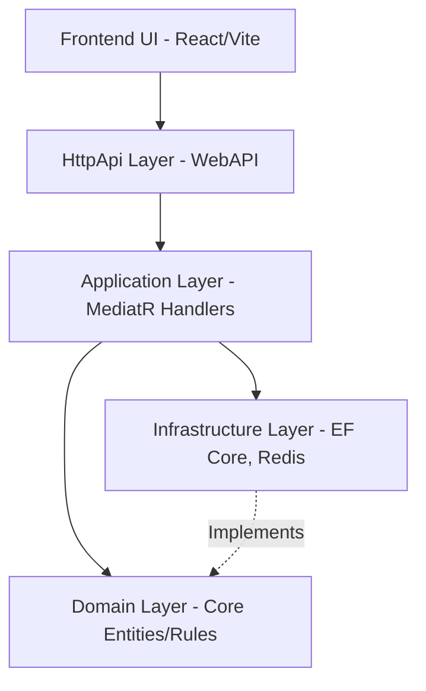

# Library Management System (LibraryMS)

Welcome to the **Library Management System (LibraryMS)**. This project is a modern, enterprise-grade, full-stack application built using a clean architecture pattern with .NET 10 on the backend and React (Vite) on the frontend.

---

## Section 1: Project Overview

### What the System Does
LibraryMS is a comprehensive, multi-branch library management solution. It empowers administrators to manage different branches, allows librarians to oversee book borrowing and returns within their specific branch, and enables public users to browse the catalog, register, and borrow books as members.

### Core Modules
- **Auth:** Registration, JWT-based authentication, and Role-Based Access Control.
- **Branch:** Management of physical library branches.
- **Book:** Centralized catalog of books, physical copies, categories, and authors.
- **Member:** Member registration, profile management, and fine history.
- **Borrow:** Core engine handling the borrowing of book copies, return processing, and overdue fine calculation.
- **Reservation:** A queuing system that allows members to reserve currently unavailable books.
- **Reports:** Generation of various analytical reports for both librarians and admins.

### User Roles
- **Public:** Can browse the book catalog, view details, and register for a membership.
- **Member:** Can log into their dashboard, borrow books, check their fine history, and update their profile.
- **Librarian:** Assigned to a specific branch. Can process borrowing, collect returns/fines, and view branch-level reports.
- **Admin:** Has global access. Can create branches, manage librarians, and view system-wide reports.

### Architecture Overview



### Tech Stack
| Tier | Technologies |
|---|---|
| **Backend** | .NET 10, Entity Framework Core, PostgreSQL, Redis, Hangfire, MailKit, Serilog |
| **Frontend** | React 18, Vite, TypeScript, TailwindCSS |

---

## Section 2: Prerequisites

Before you begin, ensure you have the following installed on your machine:
- [.NET 10 SDK](https://dotnet.microsoft.com/download/dotnet/10.0)
- [Node.js 20+](https://nodejs.org/en/download/)
- [PostgreSQL 15+](https://www.postgresql.org/download/)
- [Redis](https://redis.io/download) (For Windows, use WSL or Docker)
- [Docker Desktop](https://www.docker.com/products/docker-desktop/) (Required for Docker Setup Path)
- [Git](https://git-scm.com/downloads)

---

## Section 3: Option A — Local Development Setup (Manual)

### Step 1: Clone the Repository
```bash
git clone https://github.com/mamunur1296/LibraryMS.git
cd LibraryMS
```

### Step 2: Database Setup
1. Open PostgreSQL and create the database:
   ```sql
   CREATE DATABASE LibraryMS;
   ```
2. The database connection string is located in: `src/LibraryMS.HttpApi.Host/appsettings.json`
3. Default credentials configured in the system:
   `Host=localhost;Port=5432;Database=LibraryMS;Username=postgres;Password=2025`
4. Update the connection string with your local PostgreSQL password if it differs from `2025`.

### Step 3: Run Migrations + Seed Data
Execute the database migrator tool to apply schema changes and seed the initial data:
```bash
dotnet run --project src/LibraryMS.DbMigrator
```
**The following Seed Data will be generated:**
- **Admin User:** `admin@libraryms.com` (Password: `Admin@123`)
- **Default Branches:** Central Branch, Dhanmondi Branch, Uttara Branch
- **Sample Books:** Harry Potter, Clean Code, The Pragmatic Programmer (along with multiple physical copies)
- **Sample Categories:** Fiction, Programming, Science, History
- **Sample Authors:** J.K. Rowling, Robert C. Martin, Andrew Hunt
- **Sample Member:** `member@libraryms.com` (Password: `Member@123`)
- **Sample Librarian:** `librarian@libraryms.com` (Password: `Librarian@123`, assigned to Central Branch)

### Step 4: Redis Setup
- If using Windows, install Redis via WSL or run it via a standalone Docker command.
- Verify Redis is running by executing: `redis-cli ping` (It should return `PONG`).
- The Redis connection string is located in `appsettings.json`.

### Step 5: Run Backend API
Start the HTTP API Host:
```bash
dotnet run --project src/LibraryMS.HttpApi.Host
```
- **API URL:** `http://localhost:8080`
- **Swagger UI:** `http://localhost:8080/swagger`
- **Hangfire Dashboard:** `http://localhost:8080/hangfire`

### Step 6: Run Frontend
Navigate to the frontend directory, install dependencies, and start the development server:
```bash
cd frontend
npm install
npm run dev
```
- **Frontend URL:** `http://localhost:3000`
- Create a `.env` file in the frontend root and set your API Base URL (e.g., `VITE_API_BASE_URL=http://localhost:8080/api`).

### Step 7: Open the Application
Open your browser and navigate to `http://localhost:3000`. You can now log in using the seeded credentials.

---

## Section 4: Option B — Docker Compose Setup (Recommended)

### Prerequisites
- Docker Desktop must be running. No other local dependencies are required.

### Starting the Ecosystem
Navigate to the project root (`LibraryMS/`) and run the following single command:
```bash
docker-compose up --build
```

### Container Startup Sequence
1. **`library_ms_db` (PostgreSQL 15):** Starts and executes health checks.
2. **`library_ms_redis` (Redis 7):** Starts and executes health checks.
3. **`library_ms_migrator`:** Runs EF Core migrations and seeds initial data into the database, then exits successfully.
4. **`library_ms_api`:** Starts up only after the migrator succeeds. Accessible on port `8080`.
5. **`library_ms_frontend`:** Starts the React client. Accessible on port `3000`.

### Accessing Services
- **Frontend App:** `http://localhost:3000`
- **API Swagger:** `http://localhost:8080/swagger`
- **Hangfire Dashboard:** `http://localhost:8080/hangfire`

### Docker Commands
- **Stop all containers:** `docker-compose down`
- **Stop & wipe all data (fresh start):** `docker-compose down -v`
- **Rebuild after code changes:** `docker-compose up --build`

---

## Section 5: Default Login Credentials

Use the following default accounts to access the system:

| Role | Email | Password | Access Level |
|---|---|---|---|
| **Admin** | `admin@libraryms.com` | `Admin@123` | All features |
| **Librarian** | `librarian@libraryms.com` | `Librarian@123` | Central Branch |
| **Member** | `member@libraryms.com` | `Member@123` | Self-service |

---

## Section 6: How to Use the Application (Business Guide)

- **Public User:** Browse the extensive book catalog, view details, mark books as favorites, and seamlessly register for a new membership.
- **Member:** Log into the personal dashboard to borrow available books, review current fines and borrowing history, and update profile settings.
- **Librarian:** Access the branch-specific dashboard to process outgoing book borrows, accept returns, collect late fines, and generate operational reports.
- **Admin:** Access the global dashboard to create new branches, onboard and assign librarians, and analyze system-wide reports and statistics.

---

## Section 7: Running Tests

The solution includes comprehensive automated tests ensuring business logic validity.

### Run All Unit Tests
```bash
dotnet test
```

### Run Specific Test Projects
```bash
dotnet test test/LibraryMS.Domain.Tests
dotnet test test/LibraryMS.Application.Tests
```

---

## Section 8: Environment Variables Reference

Below is a reference of the key configuration variables used in the backend `appsettings.json` (do not commit actual secrets to version control):

- `ConnectionStrings__DefaultConnection` - The PostgreSQL connection string.
- `Jwt__Secret`, `Jwt__Issuer`, `Jwt__Audience` - Settings for JSON Web Token generation and validation.
- `Redis__ConnectionString` - The Redis connection URI.
- `Email__SmtpHost`, `Email__SmtpPort`, `Email__IsEnabled` - Settings for the SMTP mail client used by the background jobs.

---

## 🏛️ System Architecture Details

### Key Architectural Decisions

- **CQRS + MediatR:** Commands (which modify state) and Queries (which read state) are separated into distinct handlers. This decouples intent from implementation and simplifies testing.
- **Transactional Outbox Pattern:** Ensures reliable message delivery. When a `Book` is borrowed, an event is saved locally in the same database transaction. A background worker then processes this outbox queue to send emails without risking partial system failure.
- **Chain of Responsibility for Background Processing:** The Outbox background worker evaluates handlers iteratively to determine if a message should be processed via email, logging, or both.
- **Optimistic Concurrency:** High-collision entities like `Book` (where multiple users may try to borrow a copy simultaneously) use EF Core concurrency tokens to prevent overselling.
